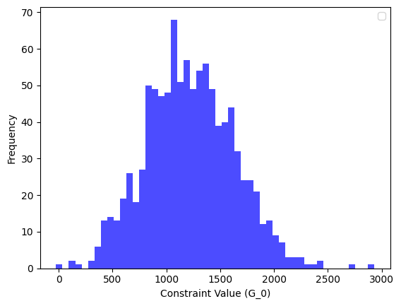
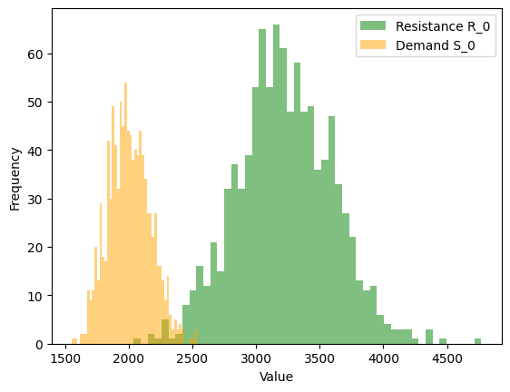

<!--Don't delete ths script-->
<script src = "https://polyfill.io/v3/polyfill.min.js?features=es6"></script>
<script id = "MathJax-script" async src="https://cdn.jsdelivr.net/npm/mathjax@3/es5/tex-mml-chtml.js"></script>
<!--Don't delete ths script-->

<p align = "justify">
    This function creates the samples and evaluates the limit state functions in structural reliability problems. Based on the data, it calculates probabilities of failure and reliability indexes.
</p>

```python
results_about_data, failure_prob_list, beta_list = sampling_algorithm_structural_analysis(setup)
```

Input variables
{: .label .label-yellow }

<table style="width:100%">
    <thead>
        <tr>
            <th>Name</th>
            <th>Description</th>
            <th>Type</th>
        </tr>
    </thead>
    <tbody>
        <tr>
            <td><code>setup</code></td>
            <td>
                <p align="justify">
                Dictionary containing the main configurations. The keys include:
                <ul>
                    <li><code>'number of samples'</code>: Number of samples [Integer]</li>
                    <br>
                    <li><code>'numerical model'</code>: Numerical model settings [Dictionary]. See details in <a href="#models">Table 1</a></li>
                    <br>
                    <li><code>'variables settings'</code>: Variables settings, listed as dictionaries [List]. See details in <a href="#variables">Table 2</a></li>
                    <br>
                    <li><code>'number of state limit functions or constraints'</code>: Number of state limit functions or constraints [Integer]</li>
                    <br>
                    <li><code>'none_variable'</code>: Generic variable for use in the objective function [None, List, Float, Dictionary, String, or other type]</li>
                    <br>
                    <li><code>'objective function'</code>: Objective function defined by the user [Python function]</li>
                    <br>
                    <li><code>'name simulation'</code>: Output filename [String or None]</li>
                </ul>
                </p>
            </td>
            <td>Dictionary</td>
        </tr>
    </tbody>
</table>

Output variables
{: .label .label-yellow }

<table style="width:100%">
    <thead>
      <tr>
        <th>Name</th>
        <th>Description</th>
        <th>Type</th>
      </tr>
    </thead>
    <tr>
        <td><code>results_about_data</code></td>
        <td>Results about reliability analysis</td>
        <td>DataFrame</td>
    </tr>
    <tr>
        <td><code>failure_prob_list</code></td>
        <td>Failure Probability</td>
        <td>List</td>
    </tr>
    <tr>
        <td><code>beta_list</code></td>
        <td>Reliability index</td>
        <td>List</td>
    </tr>
</table>

<p align="justify">
To use the sample algorithm, you must choose the algorithm and variable types and correctly fill in the <code>'numerical model'</code> and <code>'variables settings'</code> keys. See the following examples and <a href="https://wmpjrufg.github.io/PAREPY/framework_distributions_.html" target="_blank">distributions</a>.
</p>

<p align="justify" id="models"></p>
<p align="left"><b>Table 1.</b> Details of <code>'numerical model'</code> key.</p>
<center>
    <table style = "width:100%">
        <thead>
            <tr>
            <th>Type</th>
            <th>Sintax</th>
            </tr>
        </thead>
        <tr>
            <td>Crude Monte Carlo</td>
            <td><code>'numerical model': {'model sampling': 'mcs'}</code></td>
        </tr>
        <tr>
            <td>Latin Hypercube</td>
            <td><code>'numerical model': {'model sampling': 'lhs'}</code></td>
        </tr>
        <tr>
            <td>Stochastic - Crude Monte Carlo. Considering five steps in this example</td>
            <td><ul><li><code>'numerical model': {'model sampling': 'mcs-time', 'time steps': 5}</code><sup>1,2</sup></li><br><li>and <code>'none variable': {'time analysis': list(np.linspace(0, 50, num=5, endpoint=True))}</code><sup>1,2</sup></li></ul></td>
        </tr>
        <tr>
            <td>Stochastic - Latin Hypercube. Considering five steps in this example</td>
            <td><ul><li><code>'numerical model': {'model sampling': 'lhs-time', 'time steps': 5}</code><sup>1,2</sup></li><br><li>and <code>'none variable': {'time analysis': list(np.linspace(0, 50, num=5, endpoint=True))}</code><sup>1,2</sup></li></ul></td>
        </tr>
    </table>
</center>

{: .important }
>¹When applying a stochastic procedure, use a list in ```'none variables'``` with the same length as ```'time steps'```. We use five steps between 0 and 50 years in this example. In this case, a user should import the Numpy library to use ```np. linspace```. Another library can be used to create a list.

{: .important }
>²When applying a stochastic procedure, you must use the following code on top of the objective function:    

```python
id_analysis = int(x[-1])
time_step = none_variable['time analysis']
t_i = time_step[id_analysis] 
```

<p align="justify" id="variables"></p>
<p align="left"><b>Table 2.</b> Details of <code>'variable settings'</code> key.</p>
<center>
    <table style = "width:100%">
        <thead>
            <tr>
            <th>Key</th>
            <th>Description</th>
            <th>Example</th>
            </tr>
        </thead>
        <tr>
            <td><code>'type'</code></td>
            <td>Type of the distribution</td>
            <td><code>'type': 'normal'</code></td>
        </tr>
        <tr>
            <td><code>'parameters'</code></td>
            <td>Parameters of the distribution. See the <a href="https://wmpjrufg.github.io/PAREPY/framework_distributions_.html" target="_blank" rel="noopener noreferrer">parameters </a>for each distribution</td>
            <td><code>'parameters': {'mean': 40.3, 'sigma': 4.64}</code></td>
        </tr>
        <tr>
            <td><code>'stochastic variable'</code></td>
            <td>Stochastic process (<code>'True' or 'False'</code>). Use <code>'True'</code> when you wish apply stochastic process</td>
            <td><code>'stochastic variable': False</code></td>
        </tr>
    </table>
</center>

<p align="justify">
More details about the reliability method are shown in examples <a href="#example1">1</a> and <a href="#example2">2</a>.
</p>

<p align="justify" id="example1"></p>

Example 1
{: .label .label-blue }

<p align="justify">
    <i>
        Consider the simply supported beam show in example 5.1 Nowak and Collins <a href="#ref1">[1]</a>. The beam is subjected to a concentrated live load \(p\) and a uniformly distributed dead load \(w\). Assume \(\boldsymbol{P}\) (concentrated live load), \(\boldsymbol{W}\) (uniformly distributed dead load) and the yield stress, \(\boldsymbol{F_y}\), are random quantities; the length \(l\) and the plastic setion modulus \(z\) are assumed to be precisely know (deterministic). The distribution parameters for \(\boldsymbol{P}, \boldsymbol{W}\) and \(\boldsymbol{F_y}\) are given bellow:
    </i>
</p>

<table style = "width:100%; text-align: center;">
    <tr>
        <th style="width: 25%;">Variable</th>
        <th style="width: 25%;">Distribution</th>
        <th style="width: 25%;">Mean</th>
        <th style="width: 25%; text-align: justify;">Coefficient of Variation (COV)</th>
    </tr>
    <tr>
        <td style="width: 25%;">Yield stress \(\left(\boldsymbol{F_y}\right)\)</td>
        <td style="width: 25%;">Normal</td>
        <td style="width: 25%;">40.3</td>
        <td style="width: 25%;">0.115</td>
    </tr>
    <tr>
        <td style="width: 25%;">Live load \(\left(\boldsymbol{P}\right)\)</td>
        <td style="width: 25%;">Gumbel max.</td>
        <td style="width: 25%;">10.2</td>
        <td style="width: 25%;">0.110</td>
    </tr>
    <tr>
        <td style="width: 25%;">Dead load \(\left(\boldsymbol{W}\right)\)</td>
        <td style="width: 25%;">Log-normal</td>
        <td style="width: 25%;">0.25</td>
        <td style="width: 25%;">0.100</td>
    </tr>
</table>

<p align="justify">
The limit state function for beam bending can be expressed as:
</p>

<table style = "width:100%">
    <tr>
        <td style="width: 90%;">\[ \boldsymbol{R} = 80 \cdot \boldsymbol{F_y} \]</td>
        <td style="width: 10%;"><p align = "right" id = "eq1">(1)</p></td>
    </tr>
    <tr>
        <td style="width: 90%;">\[ \boldsymbol{S} = 54 \cdot \boldsymbol{P} + 5832 \cdot \boldsymbol{W} \]</td>
        <td style="width: 10%;"><p align = "right" id = "eq2">(2)</p></td>
    </tr>
    <tr>
        <td style="width: 90%;">\[ \boldsymbol{G} = \boldsymbol{R} - \boldsymbol{S} \begin{cases}
\leq 0 & \text{failure}\\ 
> 0 & \text{safe}
\end{cases} \]
        </td>
        <td style="width: 10%;"><p align = "right" id = "eq3">(3)</p></td>
    </tr>
</table>

of_file.py
{: .label .label-red }

```python
def nowak_collins_example(x, none_variable):
    """Objective function for the Nowak Collins example (tutorial).
    """

    # Random variables
    f_y = x[0]
    p_load = x[1]
    w_load = x[2]
    capacity = 80 * f_y
    demand = 54 * p_load + 5832 * w_load

    # State limit function
    constraint = capacity - demand

    return [capacity], [demand], [constraint]
```

your_problem.ipynb
{: .label .label-red }

```python
# Libraries
from parepy_toolbox import sampling_algorithm_structural_analysis
from obj_function import nowak_collins_example

# Statement random variables
f = {
        'type': 'normal', 
        'parameters': {'mean': 40.3, 'sigma': 4.64}, 
        'stochastic variable': False, 
    }

p = {
        'type': 'gumbel max',
        'parameters': {'mean': 10.2, 'sigma': 1.12}, 
        'stochastic variable': False, 
    }

w = {
        'type': 'lognormal',
        'parameters': {'mean': 0.25, 'sigma': 0.025}, 
        'stochastic variable': False, 
    }
var = [f, p, w]

# PAREpy setup
setup = {
             'number of samples': 1000, 
             'numerical model': {'model sampling': 'mcs'}, 
             'variables settings': var, 
             'number of state limit functions or constraints': 1, 
             'none variable': None,
             'objective function': nowak_collins_example,
             'name simulation': 'nowak_collins_example',
        }

# Call algorithm
results, pf, beta = sampling_algorithm_structural_analysis(setup)
```

<h3>Post-processing</h3>

<p align="justify">
    This section illustrates how to print, plot, and show these results. <b>Consider Example 1</b> to show examples of post-processing.
</p>

<h4>Show results - all samples</h4>

<p align="justify">
    What are the columns' names in the <code>results</code> variable of Example 1?
</p>

```python
# Show results in notebook file (simply use the DataFrame's variable name in code cell) 
results

# or 
# Show results in python file (using print function)
print(results)
```

<p align="justify">
    Output details:
</p>

```bash
+-----+---------+----------+----------+---------+---------+-----------+-------+
|     |     X_0 |      X_1 |      X_2 |     R_0 |     S_0 |       G_0 |   I_0 |
+=====+=========+==========+==========+=========+=========+===========+=======+
|   0 | 45.4659 |  9.93797 | 0.25921  | 3637.27 | 2048.36 | 1588.91   |     0 |
+-----+---------+----------+----------+---------+---------+-----------+-------+
|   1 | 36.4431 | 10.9928  | 0.258726 | 2915.45 | 2102.5  |  812.949  |     0 |
+-----+---------+----------+----------+---------+---------+-----------+-------+
|   2 | 29.8578 | 12.2372  | 0.221577 | 2388.63 | 1953.05 |  435.579  |     0 |
+-----+---------+----------+----------+---------+---------+-----------+-------+
...
+-----+---------+----------+----------+---------+---------+-----------+-------+
| 997 | 40.3434 |  9.06056 | 0.189791 | 3227.47 | 1596.13 | 1631.34   |     0 |
+-----+---------+----------+----------+---------+---------+-----------+-------+
| 998 | 39.6164 | 11.2624  | 0.255042 | 3169.32 | 2095.57 | 1073.74   |     0 |
+-----+---------+----------+----------+---------+---------+-----------+-------+
| 999 | 44.8962 |  9.13833 | 0.257097 | 3591.69 | 1992.86 | 1598.84   |     0 |
+-----+---------+----------+----------+---------+---------+-----------+-------+
```

<ul>
    <li><code>X_</code>: Random variables;</li>
    <li><code>R_</code>: First return in objective function (User defined);</li>
    <li><code>S_</code>: Second return in objective function (User defined);</li>
    <li><code>G_</code>: Third return in objective function (User defined). State Limit function;</li>
    <li><code>I_</code>: Indicator function (PAREpy generate).</li>
</ul>

{: .important }
>If you use two constraints, the PAREpy output shows two `G_` columns, two `R_` and `S_` columns, and two `I_` columns. The behavior occurs for more constraints.

<p align="justify">
    This problem presents one state limit function. How do we show columns that results respect a relation \(\boldsymbol{G} \geq 0 \)?
</p>

```python
# Libraries
import pandas as pd

# Analysis already realized
sorted_positive = results[results['G_0'] >= 0].sort_values(by='G_0', ascending=True)

# Show results in notebook file (simply use the DataFrame's variable name in code cell) 
sorted_positive.head(3)

# or 
# Show results in python file (using print function)
print(sorted_positive.head(3))
```

<p align="justify">
    Output details:
</p>

```bash
+-----+---------+----------+----------+---------+---------+---------+-------+
|     |     X_0 |      X_1 |      X_2 |     R_0 |     S_0 |     G_0 |   I_0 |
+=====+=========+==========+==========+=========+=========+=========+=======+
| 598 | 26.5787 | 11.1497  | 0.243887 | 2126.3  | 2024.44 | 101.861 |     0 |
+-----+---------+----------+----------+---------+---------+---------+-------+
|  78 | 30.8042 | 11.6821  | 0.285126 | 2464.34 | 2293.69 | 170.65  |     0 |
+-----+---------+----------+----------+---------+---------+---------+-------+
| 279 | 27.7097 |  9.42611 | 0.261363 | 2216.78 | 2033.28 | 183.498 |     0 |
```

<h4>Plot results - all samples</h4>

<p align="justify">
    How do we plot \(\boldsymbol{G}_0\) histogram?
</p>

```python
# Libraries
import matplotlib.pyplot as plt

# Plot histogram of G_0
plt.hist(results['G_0'], bins=50, alpha=0.7, color='blue')
plt.xlabel("Constraint Value (G_0)")
plt.ylabel("Frequency")
plt.legend()
plt.show()
```
<p align="justify">
Output details:
</p>

<center>
    
    <p align="center"><b>Figure 1.</b> Histogram of \(\boldsymbol{G}_0\).</p>
</center>

<p align="justify">
    How do we plot \(\boldsymbol{S}_0\) and \(\boldsymbol{R}_0\) in unique histogram?
</p>

```python
# Libraries
import matplotlib.pyplot as plt

# Plot histograms - R_0 and S_0
plt.hist(results['R_0'], bins=50, alpha=0.5, color='green', label='Resistance R_0')
plt.hist(results['S_0'], bins=50, alpha=0.5, color='orange', label='Demand S_0')
plt.xlabel("Value")
plt.ylabel("Frequency")
plt.legend()
plt.show()
```

<p align="justify">
Output details:
</p>

<center>
    
    <p align="center"><b>Figure 2.</b> Histogram of \(\boldsymbol{R}_0\) and \(\boldsymbol{S}_0\).</p>
</center>

<h4>Show \(p_f\) and \(\beta\) results</h4>

<p align="justify">
    Show \(p_f\) results in list format.
</p>

```python
# Acess pf results
pf_list = pf.values.flatten().tolist()
print(pf_list)
```

<p align="justify">
    Output details:
</p>

```bash
[0.0013]
```

<p align="justify">
    Show \(\beta\) results in list format.
</p>

```python
# Acess beta results
beta_list = beta.values.flatten().tolist()
print(beta_list)
```

<p align="justify">
    Output details:
</p>

```bash
[3.01145375849978]
```

<p align="justify">
    How do we print \(p_f\) and \(\beta\) together?
</p>

```python
pf_list = pf.values.flatten().tolist()
beta_list = beta.values.flatten().tolist()
for i, (p, b) in enumerate(zip(pf_list, beta_list)):
    print(f"State Limite function (g): {i}, pf: {p:.6f}, beta: {b:.6f}")
```

<p align="justify">
    Output details:
</p>

```bash
State Limite function (g): 0, pf: 0.003000, beta: 2.747781
State Limite function (g): 1, pf: 0.003000, beta: 2.747781
State Limite function (g): 2, pf: 0.003000, beta: 2.747781
State Limite function (g): 3, pf: 0.004000, beta: 2.652070
State Limite function (g): 4, pf: 0.004000, beta: 2.652070
```

<p align="justify" id="example2"></p>
Example 2
{: .label .label-blue }

<p align="justify">
<i>
    Consider the simply supported beam show in example 5.1 Nowak and Collins <a href="#ref1">[1]</a>. The beam is subjected to a concentrated live load \(p\) and a uniformly distributed dead load \(w\). Assume \(\boldsymbol{P}\) (concentrated live load), \(\boldsymbol{W}\) (uniformly distributed dead load) and the yield stress, \(\boldsymbol{F_y}\), are random quantities; the length \(l\) and the plastic setion modulus \(z\) are assumed to be precisely know (deterministic). The distribution parameters for \(\boldsymbol{P}, \boldsymbol{W}\) and \(\boldsymbol{F_y}\) are given bellow:
</i>
</p>

<table style = "width:100%; text-align: center;">
    <tr>
        <th style="width: 25%;">Variable</th>
        <th style="width: 25%;">Distribution</th>
        <th style="width: 25%;">Mean</th>
        <th style="width: 25%; text-align: justify;">Coefficient of Variation (COV)</th>
    </tr>
    <tr>
        <td style="width: 25%;">Yield stress \(\left(\boldsymbol{F_y}\right)\)</td>
        <td style="width: 25%;">Normal</td>
        <td style="width: 25%;">40.3</td>
        <td style="width: 25%;">0.115</td>
    </tr>
    <tr>
        <td style="width: 25%;">Live load¹ \(\left(\boldsymbol{P}\right)\)</td>
        <td style="width: 25%;">Gumbel max.</td>
        <td style="width: 25%;">10.2</td>
        <td style="width: 25%;">0.110</td>
    </tr>
    <tr>
        <td style="width: 25%;">Dead load \(\left(\boldsymbol{W}\right)\)</td>
        <td style="width: 25%;">Log-normal</td>
        <td style="width: 25%;">0.25</td>
        <td style="width: 25%;">0.100</td>
    </tr>
    <tr>
        <td style = "text-align: left;" colspan="4">¹Stochastic random variable</td>
    </tr>
</table>

<p align="justify">
The limit state function for beam bending can be expressed as:
</p>

<table style = "width:100%">
    <tr>
        <td style="width: 90%;">\[ \boldsymbol{R} = 80 \cdot \boldsymbol{F_y} \cdot D\]</td>
        <td style="width: 10%;"><p align = "right" id = "eq1">(1)</p></td>
    </tr>
    <tr>
        <td style="width: 90%;">\[ \boldsymbol{S} = 54 \cdot \boldsymbol{P} + 5832 \cdot \boldsymbol{W} \]</td>
        <td style="width: 10%;"><p align = "right" id = "eq2">(2)</p></td>
    </tr>
    <tr>
        <td style="width: 90%;">\[ \boldsymbol{G} = \boldsymbol{R} - \boldsymbol{S} \begin{cases}
\leq 0 & \text{failure}\\ 
> 0 & \text{safe}
\end{cases} \]
        </td>
        <td style="width: 10%;"><p align = "right" id = "eq3">(3)</p></td>
    </tr>
</table>

<p align="justify">
Consider equation <a href="#eq4">(4)</a> for resistance degradation \(\left(D\right)\) <a href="#ref2">[2]</a>. Use 50 years to stochastic analysis (five time steps). Assume that \(P\) load is a stochastic process. 
</p>

<table style = "width:100%">
    <tr>
        <td style="width: 90%;">\[ D(t_i) = 1 - \frac{0.2}{t_i} \cdot 0.01 \]</td>
        <td style="width: 10%;"><p align = "right" id = "eq4">(4)</p></td>
    </tr>
</table>

of_file.py
{: .label .label-red }

```python
def nowak_collins_time_example(x, none_variable):
    """Objective function for the Nowak example (tutorial).
    """
    
    # User must copy and paste this code in time reliability objective function
    ###########################################
    id_analysis = int(x[-1])
    time_step = none_variable['time analysis']
    t_i = time_step[id_analysis] 
    # t_i is a time value from your list of times entered in the 'none variable' key.
    ###########################################

    # Random variables
    f_y = x[0]
    p_load = x[1]
    w_load = x[2]
    
    # Degradation criteria
    if t_i == 0:
        degrad = 1
    else:
        degrad = 1 - (0.2 / t_i) * 1E-2

    # Capacity and demand
    capacity = 80 * f_y * degrad
    demand = 54 * p_load + 5832 * w_load

    # State limit function
    constraint = capacity - demand

    return [capacity], [demand], [constraint]
```

your_problem.ipynb
{: .label .label-red }

```python
# Libraries
import pandas as pd
pd.set_option('display.max_columns', None)
import numpy as np

from parepy_toolbox import sampling_algorithm_structural_analysis
from obj_function import nowak_collins_time_example

# Statement random variables
f = {
        'type': 'normal', 
        'parameters': {'mean': 40.3, 'sigma': 4.64}, 
        'stochastic variable': False, 
    }

p = {
        'type': 'gumbel max',
        'parameters': {'mean': 10.2, 'sigma': 1.12}, 
        'stochastic variable': True, 
    }

w = {
        'type': 'lognormal',
        'parameters': {'mean': 0.25, 'sigma': 0.025}, 
        'stochastic variable': False, 
    }
var = [f, p, w]

# PAREpy setup
setup = {
             'number of samples': 1000, 
             'numerical model': {'model sampling': 'mcs-time', 'time steps': 5}, 
             'variables settings': var, 
             'number of state limit functions or constraints': 1, 
             'none variable': {'time analysis': list(np.linspace(0, 50, num=5, endpoint=True))},
             'objective function': nowak_collins_time_example,
             'name simulation': 'nowak_collins_time_example',
        }

# Call algorithm
results, pf, beta = sampling_algorithm_structural_analysis(setup)
```

<h3>Post-processing</h3>

<h4>Show results - all samples</h4>

<p align="justify">
    What are the columns' names in the results of Example 2?
</p>

```bash
+-----+-----------+-----------+-----------+-----------+-----------+-----------+-----------+-----------+-----------+-----------+-----------+-----------+-----------+-----------+-----------+------------+------------+------------+------------+------------+-----------+-----------+-----------+-----------+-----------+-----------+-----------+-----------+-----------+-----------+-----------+-----------+-----------+-----------+-----------+-----------+-----------+-----------+-----------+-----------+
|     |   X_0_t=0 |   X_0_t=1 |   X_0_t=2 |   X_0_t=3 |   X_0_t=4 |   X_1_t=0 |   X_1_t=1 |   X_1_t=2 |   X_1_t=3 |   X_1_t=4 |   X_2_t=0 |   X_2_t=1 |   X_2_t=2 |   X_2_t=3 |   X_2_t=4 |   STEP_t_0 |   STEP_t_1 |   STEP_t_2 |   STEP_t_3 |   STEP_t_4 |   R_0_t=0 |   R_0_t=1 |   R_0_t=2 |   R_0_t=3 |   R_0_t=4 |   S_0_t=0 |   S_0_t=1 |   S_0_t=2 |   S_0_t=3 |   S_0_t=4 |   G_0_t=0 |   G_0_t=1 |   G_0_t=2 |   G_0_t=3 |   G_0_t=4 |   I_0_t=0 |   I_0_t=1 |   I_0_t=2 |   I_0_t=3 |   I_0_t=4 |
+=====+===========+===========+===========+===========+===========+===========+===========+===========+===========+===========+===========+===========+===========+===========+===========+============+============+============+============+============+===========+===========+===========+===========+===========+===========+===========+===========+===========+===========+===========+===========+===========+===========+===========+===========+===========+===========+===========+===========+
|   0 |   34.7571 |   34.7571 |   34.7571 |   34.7571 |   34.7571 |  13.5025  |  10.6468  |  10.0188  |  10.3869  |  14.0795  |  0.275001 |  0.275001 |  0.275001 |  0.275001 |  0.275001 |          0 |          1 |          2 |          3 |          4 |   2780.56 |   2780.12 |   2780.34 |   2780.42 |   2780.45 |   2332.94 |   2178.73 |   2144.82 |   2164.7  |   2364.1  |  447.625  |   601.389 |   635.52  |  615.72   |   416.352 |         0 |         0 |         0 |         0 |         0 |
+-----+-----------+-----------+-----------+-----------+-----------+-----------+-----------+-----------+-----------+-----------+-----------+-----------+-----------+-----------+-----------+------------+------------+------------+------------+------------+-----------+-----------+-----------+-----------+-----------+-----------+-----------+-----------+-----------+-----------+-----------+-----------+-----------+-----------+-----------+-----------+-----------+-----------+-----------+-----------+
|   1 |   40.5636 |   40.5636 |   40.5636 |   40.5636 |   40.5636 |   9.29018 |   9.07671 |  13.0581  |  10.3811  |  10.5524  |  0.276317 |  0.276317 |  0.276317 |  0.276317 |  0.276317 |          0 |          1 |          2 |          3 |          4 |   3245.09 |   3244.57 |   3244.83 |   3244.91 |   3244.96 |   2113.15 |   2101.63 |   2316.62 |   2172.06 |   2181.31 | 1131.93   |  1142.94  |   928.207 | 1072.85   |  1063.64  |         0 |         0 |         0 |         0 |         0 |
+-----+-----------+-----------+-----------+-----------+-----------+-----------+-----------+-----------+-----------+-----------+-----------+-----------+-----------+-----------+-----------+------------+------------+------------+------------+------------+-----------+-----------+-----------+-----------+-----------+-----------+-----------+-----------+-----------+-----------+-----------+-----------+-----------+-----------+-----------+-----------+-----------+-----------+-----------+-----------+
|   2 |   38.9735 |   38.9735 |   38.9735 |   38.9735 |   38.9735 |  10.6705  |   9.94778 |  11.5999  |  12.1341  |   9.89408 |  0.224981 |  0.224981 |  0.224981 |  0.224981 |  0.224981 |          0 |          1 |          2 |          3 |          4 |   3117.88 |   3117.38 |   3117.63 |   3117.71 |   3117.75 |   1888.29 |   1849.27 |   1938.48 |   1967.33 |   1846.37 | 1229.58   |  1268.11  |  1179.15  | 1150.38   |  1271.38  |         0 |         0 |         0 |         0 |         0 |
+-----+-----------+-----------+-----------+-----------+-----------+-----------+-----------+-----------+-----------+-----------+-----------+-----------+-----------+-----------+-----------+------------+------------+------------+------------+------------+-----------+-----------+-----------+-----------+-----------+-----------+-----------+-----------+-----------+-----------+-----------+-----------+-----------+-----------+-----------+-----------+-----------+-----------+-----------+-----------+
```

<ul>
    <li><code>X_i_t</code>: Random variables in specific time step;</li>
    <li><code>STEP_t_</code>: Time step ID;</li>
    <li><code>R_i_t</code>: First return in objective function (User defined) -  in specific time step;</li>
    <li><code>S_i_t</code>: Second return in objective function (User defined) -  in specific time step;</li>
    <li><code>G_i_t</code>: Second return in objective function (User defined) -  in specific time step;</li>
    <li><code>I_i_t</code>: Indicator function (PAREpy generate) -  in specific time step.</li>
</ul>


{: .important }
>If you use two constraints, the PAREpy output will show two G_ columns, two R_ and S_ columns, and two I_ columns. However, in time-dependent reliability cases, PAREpy uses first-barrier failure criteria to evaluate the probability of failure. Therefore, all outputs have the same user-specified time interval.

<h4>Show \(p_f\) and \(\beta\) results</h4>

<p align="justify">
    Show \(p_f\) results in list format. To view results about all time steps in \(G_0\) state limit function folliwing code:
</p>

```python
# Acess pf results
pf_list = pf['G_0'].tolist()
print(pf_list)
```

<p align="justify">
    Output details:
</p>

```bash
[0.003, 0.003, 0.003, 0.004, 0.004]
```

<p align="justify">
    Show \(\beta\) results in list format.
</p>

```python
# Acess beta results
beta_list = beta['G_0'].tolist()
print(beta_list)
```

<p align="justify">
    Output details:
</p>

```bash
[2.7477813854449726, 2.7477813854449726, 2.7477813854449726, 2.652069807902187, 2.652069807902187]
```

<p align="justify">
    How do we print \(p_f\) and \(\beta\) together?
</p>

```python
pf_list = pf['G_0'].tolist()
beta_list = beta['G_0'].tolist()
for i, (p, b) in enumerate(zip(pf_list, beta_list)):
    print(f"Time step (id={i}, time={setup['none variable']['time analysis'][i]}), pf: {p:.6f}, beta: {b:.6f}")
```

<p align="justify">
    Output details:
</p>

```bash
Time step (id=0, time=0.0), pf: 0.003000, beta: 2.747781
Time step (id=1, time=12.5), pf: 0.003000, beta: 2.747781
Time step (id=2, time=25.0), pf: 0.003000, beta: 2.747781
Time step (id=3, time=37.5), pf: 0.004000, beta: 2.652070
Time step (id=4, time=50.0), pf: 0.004000, beta: 2.652070
```

<h1>Reference list</h1>

<table>
    <thead>
        <tr>
            <th>ID</th>
            <th>Reference</th>
        </tr>
    </thead>
    <tbody>
        <tr>
            <td><p align = "center" id = "ref1">[1]</p></td>
            <td><p align = "left"><a href="https://doi.org/10.1007/s00521-016-2328-2" target="_blank" rel="noopener noreferrer">Nowak AS, Collins KR. Reliability of Structures. 2nd edition. CRC Press; 2012.</a></p></td>
        </tr>
        <tr>
            <td><p align = "center" id = "ref2">[2]</p></td>
            <td><p align = "left"><a href="https://doi.org/10.1007/s00521-016-2328-2" target="_blank" rel="noopener noreferrer">Beck AT. Confiabilidade e segurança das estruturas. Elsevier; 2019. ISBN 978-85-352-8895-7</a></p></td>
        </tr>
    </tbody>
</table>
