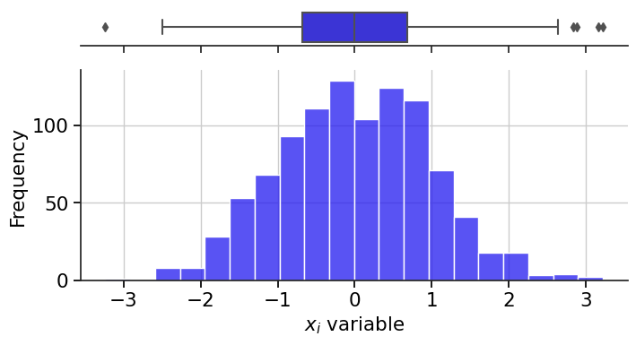
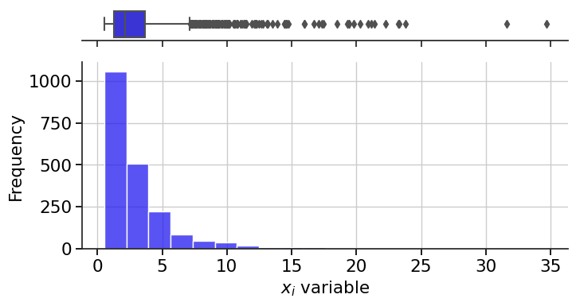

<!--Don't delete ths script-->
<script src = "https://polyfill.io/v3/polyfill.min.js?features=es6"></script>
<script id = "MathJax-script" async src="https://cdn.jsdelivr.net/npm/mathjax@3/es5/tex-mml-chtml.js"></script>
<!--Don't delete ths script-->

<h3>sampling</h3>
<br>
<p align = "justify">
    This algorithm generates a set of random numbers according to a type of distribution.
</p>

```python
random_sampling = sampling(n_samples, d, model, variables_setup)
```

Input variables
{: .label .label-yellow }

<table style = "width:100%">
    <thead>
      <tr>
        <th>Name</th>
        <th>Description</th>
        <th>Type</th>
      </tr>
    </thead>
    <tr>
        <td><code>n_samples</code></td>
        <td>Number of samples</td>
        <td>Integer</td>
    </tr>
    <tr>
        <td><code>d</code></td>
        <td>Number of dimensions</td>
        <td>Integer</td>
    </tr>
    <tr>
        <td><code>model</code></td>
        <td>Model parameters</td>
        <td>Dictionary</td>
    </tr>
    <tr>
        <td><code>variables_setup</code></td>
        <td><p align = "justify">Random variable parameters (list of dictionary format).</p></td>
        <td>List</td>
    </tr>
</table>

Output variables
{: .label .label-yellow}

<table style = "width:100%">
   <thead>
     <tr>
       <th>Name</th>
       <th>Description</th>
       <th>Type</th>
     </tr>
   </thead>
   <tr>
       <td><code>random_sampling</code></td>
       <td>Random samples</td>
       <td>Numpy array</td>
   </tr>
</table>

<ol>
    <li><a href="#norm">Normal or Gaussian</a></li>
    <li><a href="#norm-time">Normal or Gaussian - Stochastic</a></li>
    <li><a href="#trian">Triangular</a></li>
    <li><a href="gmax">Gumbel Max</a></li>
    <li><a href="gmin">Gumbel Min</a></li>
    <li><a href="lognormal">Log-normal</a></li>
</ol>

<h4><i>Normal or Gaussian</i></h4>
<p align = "justify" id = "norm"></p>

MODEL PARAMETERS
{: .label .label-red }

<h6><i>Crude Monte Carlo</i></h6>

```python
model = {'model sampling': 'mcs'}
```

<table style = "width:100%">
    <thead>
      <tr>
        <th>Name</th>
        <th>Description</th>
        <th>Type</th>
      </tr>
    </thead> 
    <tr>
        <td><code>'model sampling'</code></td>
        <td>Numerical algorithm used in sampling generator</td>
        <td>String</td>
    </tr>
</table>

VARIABLES SETTINGS
{: .label .label-red }

```python
var = {'type': 'normal', 'loc': 40.3, 'scale': 4.64, 'seed': None}
```

<table style = "width:100%">
    <thead>
      <tr>
        <th>Name</th>
        <th>Description</th>
        <th>Type</th>
      </tr>
    </thead> 
    <tr>
        <td><code>'type'</code></td>
        <td>Type of probability density function</td>
        <td>String</td>
    </tr>
    <tr>
        <td><code>'loc'</code></td>
        <td>Mean</td>
        <td>Float</td>
    </tr>
    <tr>
        <td><code>'scale'</code></td>
        <td>Standard deviation</td>
        <td>Float</td>
    </tr>
    <tr>
        <td><code>'seed'</code></td>
        <td>Random seed. Use <code>None</code> for random seed</td>
        <td>Integer</td>
    </tr>
</table>

Example 1
{: .label .label-blue }

<p align = "justify">
    <i>In this example, we will use the <code>sampling</code> function to generate a set of random samples \((n=1000000)\) following a Normal distribution with mean \(\mu = 7\) and standard deviation \(\sigma = 3\). Use "seed without control" in your setup.</i>
</p>

```python
from parepy_toolbox import sampling

# Dataset
model = {'model sampling': 'mcs'}
f = {'type': 'normal', 'loc': 7, 'scale': 3, 'seed': None}
varSet = [f]
size = 1000000

# Call function
r = sampling(size, len(varSet), model, varSet)

# Output details
print(f'random variables n={len(r)}: \n\n {r} \n\n type variable: {type(r)}')
```

```bash
random variables n=1000000: 

 [[ 3.5106688 ]
 [ 5.69074161]
 [ 8.60932312]
 ...
 [10.28841779]
 [ 7.25655855]
 [ 7.21348877]] 

 type variable: <class 'numpy.ndarray'>
```

<center>
    
    <p align="center"><b>Figure 1.</b> Random variable example 1.</p>
</center>

<h4><i>Normal or Gaussian - Stochastic</i></h4>
<p align = "justify" id = "norm-time"></p>

MODEL PARAMETERS
{: .label .label-red }

<h6><i>Crude Monte Carlo</i></h6>

```python
model = {'model sampling': 'mcs-time', 'time steps': 5}
```

<table style = "width:100%">
    <thead>
      <tr>
        <th>Name</th>
        <th>Description</th>
        <th>Type</th>
      </tr>
    </thead> 
    <tr>
        <td><code>'model sampling'</code></td>
        <td>Numerical algorithm used in sampling generator</td>
        <td>String</td>
    </tr>
    <tr>
        <td><code>'time steps'</code></td>
        <td>Number of time steps used in times series analysis</td>
        <td>Integer</td>
    </tr>
</table>

VARIABLES SETTINGS
{: .label .label-red }

```python
var = {'type': 'normal', 'loc': 40.3, 'scale': 4.64, 'stochastic variable': False, 'seed': None}
```

<table style = "width:100%">
    <thead>
      <tr>
        <th>Name</th>
        <th>Description</th>
        <th>Type</th>
      </tr>
    </thead> 
    <tr>
        <td><code>'type'</code></td>
        <td>Type of probability density function</td>
        <td>String</td>
    </tr>
    <tr>
        <td><code>'loc'</code></td>
        <td>Mean</td>
        <td>Float</td>
    </tr>
    <tr>
        <td><code>'scale'</code></td>
        <td>Standard deviation</td>
        <td>Float</td>
    </tr>
    <tr>
      <td><code>'seed'</code></td>
      <td>Random seed. Use <code>None</code> for random seed</td>
      <td>Integer</td>
    </tr>
    <tr>
        <td><code>'stochastic variable'</code></td>
        <td><p align = "justify">This variable represents the behavior of the random variable over time intervals. <code>False</code> means the variable with a fixed value in each time interval, and <code>True</code> represents the random behavior of the variable in each time interval.</p></td>
        <td>Boolean</td>
    </tr>
</table>

Example 2
{: .label .label-blue }

<p align = "justify">
    <i>In this example, we will use the <code>sampling</code> function to generate a set of random samples \((n=30)\) following a Normal distribution with mean \(\mu = 7\) and standard deviation \(\sigma = 3\). Use "stochastic variable" in your setup and generate fixed values each time step.</i>
</p>

```python
from parepy_toolbox import sampling

# Dataset: fixed value in time series
model = {'model sampling': 'mcs-time', 'time steps': 3}
f = {'type': 'normal', 'loc': 7, 'scale': 3, 'seed': None, 'stochastic variable': False}
varSet = [f]
size = 30

# Call function
r = sampling(size, len(varSet), model, varSet)
print(f'random variables n={len(r)}: \n\n {r} \n\n type variable: {type(r)}')
```

```bash
random variables n=90: 

[[ 9.83084403  0.        ]  --> sample 0 time step = 0
 [ 9.83084403  1.        ]  --> sample 0 time step = 1
 [ 9.83084403  2.        ]  --> sample 0 time step = 2
 [10.21614749  0.        ]  --> sample 1 time step = 0
 [10.21614749  1.        ]  --> sample 1 time step = 1
 [10.21614749  2.        ]  --> sample 1 time step = 2
 [10.06481753  0.        ]  --> sample 2 time step = 0
 [10.06481753  1.        ]  --> sample 2 time step = 1
 [10.06481753  2.        ]  --> sample 2 time step = 2
 ...
 [8.55312079  0.        ]  --> sample 29 time step = 0
 [8.55312079  1.        ]  --> sample 29 time step = 1
 [8.55312079  2.        ]] --> sample 29 time step = 2

type variable: <class 'numpy.ndarray'>
```

Example 3
{: .label .label-blue }

<p align = "justify">
    <i>In this example, we will use the <code>sampling</code> function to generate a set of random samples \((n=30)\) following a Normal distribution with mean \(\mu = 7\) and standard deviation \(\sigma = 3\). Use "stochastic variable" in your setup and generate different values each time step.</i>
</p>

```python
from parepy_toolbox import sampling

# Dataset stochastic value in time series
model = {'model sampling': 'mcs-time', 'time steps': 3}
f = {'type': 'normal', 'loc': 7, 'scale': 3, 'seed': None, 'stochastic variable': True}
varSet = [f]
size = 30

# Call function
r = sampling(size, len(varSet), model, varSet)
print(f'random variables n={len(r)}: \n\n {r} \n\n type variable: {type(r)}')
```

```bash
random variables n=90: 

[[7.73489316  0.        ]  --> sample 0 time step = 0
 [2.39698123  1.        ]  --> sample 0 time step = 1
 [6.73925933  2.        ]  --> sample 0 time step = 2
 [5.09639542  0.        ]  --> sample 1 time step = 0
 [5.46050213  1.        ]  --> sample 1 time step = 1
 [6.77307753  2.        ]  --> sample 1 time step = 2
 [5.15205194  0.        ]  --> sample 2 time step = 0
 [6.95330405  1.        ]  --> sample 2 time step = 1
 [6.65245261  2.        ]  --> sample 2 time step = 2
 ...
 [8.55312079  0.        ]  --> sample 29 time step = 0
 [9.12659394  1.        ]  --> sample 29 time step = 1
 [9.12659394  2.        ]] --> sample 29 time step = 2

type variable: <class 'numpy.ndarray'>
```


<h4><i>Triangular sampling</i></h4>
<p align = "justify" id = "trian"></p>

MODEL PARAMETERS
{: .label .label-red }

<h6><i>Crude Monte Carlo</i></h6>

```python
model = {'model sampling': 'mcs', 'time steps': 5}
```

VARIABLES SETTINGS
{: .label .label-red }

```python
var = {'type': 'triangular', 'min': 3, 'loc': 7, 'max': 8, 'seed': None}
```

<table style = "width:100%">
    <thead>
      <tr>
        <th>Name</th>
        <th>Description</th>
        <th>Type</th>
      </tr>
    </thead> 
    <tr>
        <td><code>'type'</code></td>
        <td>Type of probability density function</td>
        <td>String</td>
    </tr>
        <tr>
        <td><code>'min'</code></td>
        <td>Minimum value</td>
        <td>Float</td>
    </tr>
    <tr>
        <td><code>'loc'</code></td>
        <td>Mean</td>
        <td>Float</td>
    </tr>
    <tr>
        <td><code>'max'</code></td>
        <td>Maximum value</td>
        <td>Float</td>
    </tr>
    <tr>
        <td><code>'seed'</code></td>
        <td>Random seed. Use <code>None</code> for random seed</td>
        <td>Integer</td>
    </tr>
</table>

<h4><i>Triangular sampling in time series</i></h4>

MODEL PARAMETERS
{: .label .label-red }

<h6><i>Crude Monte Carlo</i></h6>

```python
model = {'model sampling': 'mcs-time', 'time steps': 5}
```

VARIABLES SETTINGS
{: .label .label-red }

```python
var = {'type': 'triangular', 'min': 3, 'loc': 7, 'max': 8, 'stochastic variable': False, 'seed': None}
```

<table style = "width:100%">
    <thead>
      <tr>
        <th>Name</th>
        <th>Description</th>
        <th>Type</th>
      </tr>
    </thead> 
    <tr>
        <td><code>'type'</code></td>
        <td>Type of probability density function</td>
        <td>String</td>
    </tr>
    <tr>
        <td><code>'loc'</code></td>
        <td>Mean</td>
        <td>Float</td>
    </tr>
    <tr>
        <td><code>'min'</code></td>
        <td>Minimum value</td>
        <td>Float</td>
    </tr>
    <tr>
        <td><code>'max'</code></td>
        <td>Maximum value</td>
        <td>Float</td>
    </tr>
    <tr>
      <td><code>'seed'</code></td>
      <td>Random seed. Use <code>None</code> for random seed</td>
      <td>Integer</td>
    </tr>
    <tr>
        <td><code>'stochastic variable'</code></td>
        <td><p align = "justify">This variable represents the behavior of the random variable over time intervals. <code>False</code> means the variable with a fixed value in each time interval, and <code>True</code> represents the random behavior of the variable in each time interval.</p></td>
        <td>Boolean</td>
    </tr>
</table>

Example 4 
{: .label .label-blue }

<p align = "justify">
    <i>In this example, we will use the <code>sampling</code> function to generate a set of random samples \((n=30)\) following a Triangular distribution with mean \(\mu = 7\) and standard deviation \(\sigma = 3\). Use "stochastic variable" in your setup and generate different values each time step.</i>
</p>

```python
from parepy_toolbox import sampling

# Dataset fixed value in time series
model = {'model sampling': 'mcs-time', 'time steps': 3}
f = {'type': 'triangular', 'min': 3, 'loc': 7, 'max': 8, 'seed': None, 'stochastic variable': False}
varSet = [f]
size = 5

# Call function
r = sampling(size, len(varSet), model, varSet)
print(r)
```
```bash
[[6.20583102 0.        ]
 [6.20583102 1.        ]
 [6.20583102 2.        ]
 [7.51896212 0.        ]
 [7.51896212 1.        ]
 [7.51896212 2.        ]
 [5.33441516 0.        ]
 [5.33441516 1.        ]
 [5.33441516 2.        ]
 [3.86008801 0.        ]
 [3.86008801 1.        ]
 [3.86008801 2.        ]
 [5.33573491 0.        ]
 [5.33573491 1.        ]
 [5.33573491 2.        ]]

```

<h4><i>Gumbel max. sampling</i></h4>
<p align = "justify" id = "gmax"></p>

MODEL PARAMETERS
{: .label .label-red }


VARIABLES SETTINGS
{: .label .label-red }

```python
var = {'type': 'gumbel max', 'loc': 40.3, 'scale': 4.64, 'seed': None}
```

<table style = "width:100%">
    <thead>
      <tr>
        <th>Name</th>
        <th>Description</th>
        <th>Type</th>
      </tr>
    </thead> 
    <tr>
        <td><code>'type'</code></td>
        <td>Type of probability density function</td>
        <td>String</td>
    </tr>
    <tr>
        <td><code>'loc'</code></td>
        <td>Mean</td>
        <td>Float</td>
    </tr>
    <tr>
        <td><code>'scale'</code></td>
        <td>Standard deviation</td>
        <td>Float</td>
    </tr>
    <tr>
        <td><code>'seed'</code></td>
        <td>Random seed. Use <code>None</code> for random seed</td>
        <td>Integer</td>
    </tr>
</table>

<h4><i>Gumbel max. sampling in time series</i></h4>

MODEL PARAMETERS
{: .label .label-red }


VARIABLES SETTINGS
{: .label .label-red }

```python
var = {'type': 'gumbel max', 'loc': 40.3, 'scale': 4.64, 'stochastic variable': False, 'seed': None}
```

<table style = "width:100%">
    <thead>
      <tr>
        <th>Name</th>
        <th>Description</th>
        <th>Type</th>
      </tr>
    </thead> 
    <tr>
        <td><code>'type'</code></td>
        <td>Type of probability density function</td>
        <td>String</td>
    </tr>
    <tr>
        <td><code>'loc'</code></td>
        <td>Mean</td>
        <td>Float</td>
    </tr>
    <tr>
        <td><code>'scale'</code></td>
        <td>Standard deviation</td>
        <td>Float</td>
    </tr>
    <tr>
      <td><code>'seed'</code></td>
      <td>Random seed. Use <code>None</code> for random seed</td>
      <td>Integer</td>
    </tr>
    <tr>
        <td><code>'stochastic variable'</code></td>
        <td><p align = "justify">This variable represents the behavior of the random variable over time intervals. <code>False</code> means the variable with a fixed value in each time interval, and <code>True</code> represents the random behavior of the variable in each time interval.</p></td>
        <td>Boolean</td>
    </tr>
</table>

Example 5 
{: .label .label-blue }

<p align = "justify">
    <i>In this example, we will use the <code>sampling</code> function to generate a set of random samples \((n=30)\) following a Gumbel max. distribution with mean \(\mu = 7\) and standard deviation \(\sigma = 3\). Use "stochastic variable" in your setup and generate different values each time step.</i>
</p>

```python
# Dataset
model = {'model sampling': 'mcs'}
f = {'type': 'gumbel max', 'loc': 7, 'scale': 3, 'seed': None}
varSet = [f]
size = 1000000

# Call function
r = sampling(size, len(varSet), model, varSet)
print(r)
```
```bash
[[ 8.46468577]
 [ 7.97594375]
 [ 5.32736034]
 ...
 [10.59271284]
 [10.83029474]
 [ 3.85476323]]
```

<h4><i>Gumbel min. sampling</i></h4>
<p align = "justify" id = "gmin"></p>

MODEL PARAMETERS
{: .label .label-red }


VARIABLES SETTINGS
{: .label .label-red }

```python
var = {'type': 'gumbel min', 'loc': 40.3, 'scale': 4.64, 'seed': None}
```

<table style = "width:100%">
    <thead>
      <tr>
        <th>Name</th>
        <th>Description</th>
        <th>Type</th>
      </tr>
    </thead> 
    <tr>
        <td><code>'type'</code></td>
        <td>Type of probability density function</td>
        <td>String</td>
    </tr>
    <tr>
        <td><code>'loc'</code></td>
        <td>Mean</td>
        <td>Float</td>
    </tr>
    <tr>
        <td><code>'scale'</code></td>
        <td>Standard deviation</td>
        <td>Float</td>
    </tr>
    <tr>
        <td><code>'seed'</code></td>
        <td>Random seed. Use <code>None</code> for random seed</td>
        <td>Integer</td>
    </tr>
</table>

<h4><i>Gumbel min. sampling in time series</i></h4>

MODEL PARAMETERS
{: .label .label-red }


VARIABLES SETTINGS
{: .label .label-red }

```python
var = {'type': 'gumbel min', 'loc': 40.3, 'scale': 4.64, 'stochastic variable': False, 'seed': None}
```

<table style = "width:100%">
    <thead>
      <tr>
        <th>Name</th>
        <th>Description</th>
        <th>Type</th>
      </tr>
    </thead> 
    <tr>
        <td><code>'type'</code></td>
        <td>Type of probability density function</td>
        <td>String</td>
    </tr>
    <tr>
        <td><code>'loc'</code></td>
        <td>Mean</td>
        <td>Float</td>
    </tr>
    <tr>
        <td><code>'scale'</code></td>
        <td>Standard deviation</td>
        <td>Float</td>
    </tr>
    <tr>
      <td><code>'seed'</code></td>
      <td>Random seed. Use <code>None</code> for random seed</td>
      <td>Integer</td>
    </tr>
    <tr>
        <td><code>'stochastic variable'</code></td>
        <td><p align = "justify">This variable represents the behavior of the random variable over time intervals. <code>False</code> means the variable with a fixed value in each time interval, and <code>True</code> represents the random behavior of the variable in each time interval.</p></td>
        <td>Boolean</td>
    </tr>
</table>

Example 6
{: .label .label-blue }

<p align = "justify">
    <i>In this example, we will use the <code>sampling</code> function to generate a set of random samples \((n=30)\) following a Gumbel min. distribution with mean \(\mu = 7\) and standard deviation \(\sigma = 3\). Use "stochastic variable" in your setup and generate different values each time step.</i>
</p>

```python
# Dataset
model = {'model sampling': 'mcs'}
f = {'type': 'gumbel min', 'loc': 7, 'scale': 3, 'seed': None}
varSet = [f]
size = 1000000

# Call function
r = sampling(size, len(varSet), model, varSet)
print(r)
```
```bash
[[ 6.6573527 ]
 [ 2.67428949]
 [-5.30074766]
 ...
 [ 9.0293629 ]
 [ 8.65583937]
 [ 4.99922794]]
``` 


<h4><i>Log-normal sampling</i></h4>
<p align = "justify" id = "lognormal"></p>

MODEL PARAMETERS
{: .label .label-red }


VARIABLES SETTINGS
{: .label .label-red }

```python
var = {'type': 'lognormal', 'loc': 40.3, 'scale': 4.64, 'seed': None}
```

<table style = "width:100%">
    <thead>
      <tr>
        <th>Name</th>
        <th>Description</th>
        <th>Type</th>
      </tr>
    </thead> 
    <tr>
        <td><code>'type'</code></td>
        <td>Type of probability density function</td>
        <td>String</td>
    </tr>
    <tr>
        <td><code>'loc'</code></td>
        <td>Mean</td>
        <td>Float</td>
    </tr>
    <tr>
        <td><code>'scale'</code></td>
        <td>Standard deviation</td>
        <td>Float</td>
    </tr>
    <tr>
        <td><code>'seed'</code></td>
        <td>Random seed. Use <code>None</code> for random seed</td>
        <td>Integer</td>
    </tr>
</table>

<h4><i>Log-normal sampling in time series</i></h4>

MODEL PARAMETERS
{: .label .label-red }


VARIABLES SETTINGS
{: .label .label-red }

```python
var = {'type': 'lognormal', 'loc': 40.3, 'scale': 4.64, 'stochastic variable': False, 'seed': None}
```

<table style = "width:100%">
    <thead>
      <tr>
        <th>Name</th>
        <th>Description</th>
        <th>Type</th>
      </tr>
    </thead> 
    <tr>
        <td><code>'type'</code></td>
        <td>Type of probability density function</td>
        <td>String</td>
    </tr>
    <tr>
        <td><code>'loc'</code></td>
        <td>Mean</td>
        <td>Float</td>
    </tr>
    <tr>
        <td><code>'scale'</code></td>
        <td>Standard deviation</td>
        <td>Float</td>
    </tr>
    <tr>
      <td><code>'seed'</code></td>
      <td>Random seed. Use <code>None</code> for random seed</td>
      <td>Integer</td>
    </tr>
    <tr>
        <td><code>'stochastic variable'</code></td>
        <td><p align = "justify">This variable represents the behavior of the random variable over time intervals. <code>False</code> means the variable with a fixed value in each time interval, and <code>True</code> represents the random behavior of the variable in each time interval.</p></td>
        <td>Boolean</td>
    </tr>
</table>

<p align = "center"><b>Figure 3.</b> Gumbel Distribution using Sampling function.</p>
<center></center>

Example 7
{: .label .label-blue }

<p align = "justify">
    <i>In this example, we will use the <code>sampling</code> function to generate a set of random samples \((n=30)\) following a Lognormal distribution with mean \(\mu = 7\) and standard deviation \(\sigma = 3\). Use "stochastic variable" in your setup and generate different values each time step.</i>
</p>

```python
# Dataset stochastic value in time series
model = {'model sampling': 'mcs-time', 'time steps': 3}
f = {'type': 'lognormal', 'loc': 1, 'scale': 0.05, 'seed': None, 'stochastic variable': True}
varSet = [f]
size = 3

# Call function
r = sampling(size, len(varSet), model, varSet)
r
``` 
```bash
array([[0.83752631, 0.        ],
       [0.8696238 , 1.        ],
       [1.02854465, 2.        ],
       [0.99895127, 0.        ],
       [0.9736836 , 1.        ],
       [1.03284045, 2.        ],
       [0.9287761 , 0.        ],
       [0.98123592, 1.        ],
       [0.96828351, 2.        ]])
``` 
