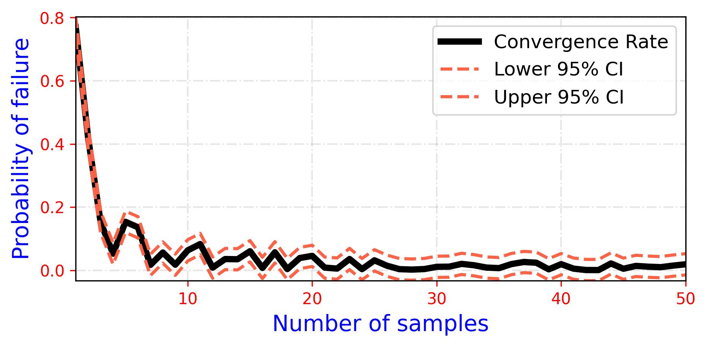

<!--Don't delete ths script-->
<script src = "https://polyfill.io/v3/polyfill.min.js?features=es6"></script>
<script id = "MathJax-script" async src="https://cdn.jsdelivr.net/npm/mathjax@3/es5/tex-mml-chtml.js"></script>
<!--Don't delete ths script-->

<h3>Convergence Rate Calculation</h3>
<br>
<p align = "justify">
    This function calculates and plots the convergence rate based on the given column of a DataFrame. It computes the probability of failure (pf) for each row and visualizes it using a line chart.
</p>

```python
convergence_rote(df, column)
```

Input variables
{: .label .label-yellow }

<table style = "width:100%">
    <thead>
      <tr>
        <th>Name</th>
        <th>Description</th>
        <th>Type</th>
      </tr>
    </thead>
    <tr>
        <td><code>df</code></td>
        <td>DataFrame containing the data to be processed.</td>
        <td>DataFrame</td>
    </tr>
    <tr>
        <td><code>column</code></td>
        <td>Name of the column to be used for calculating the convergence rate.</td>
        <td>String</td>
    </tr>
</table>

Output variables
{: .label .label-yellow }

<table style = "width:100%">
   <thead>
     <tr>
       <th>Name</th>
       <th>Description</th>
       <th>Type</th>
     </tr>
   </thead>
   <tr>
       <td><code>plot</code></td>
       <td>Line chart showing the convergence rate.</td>
       <td>Chart</td>
   </tr>
</table>

<h4><i>Example Usage</i></h4>
<p align = "justify" id = "convergence-example"></p>

MODEL PARAMETERS
{: .label .label-red }

<h6><i>Chart Configuration</i></h6>

```python
chart_config = {
    'name': 'convergence_rate_chart',
    'width': 16.0, 
    'height': 8.0,
    'extension': 'jpg',
    'dots_per_inch': 300, 
    'marker': [None, None, None],
    'marker_size': [20, 20, 20],
    'line_width': [4, 2, 2],
    'line_style': ['-', '--', '--'],
    'x_axis_label': 'Number of samples',
    'x_axis_size': 10,
    'y_axis_label': 'Probability of failure',
    'y_axis_size': 10,
    'axises_color': 'red',
    'labels_size': 14,
    'labels_color': 'blue',
    'chart_color': ['#000000', '#FF6347', '#FF6347'],
    'on_grid': True,
    'legend': ['Convergence Rate', 'Lower 95% CI', 'Upper 95% CI'],
    'legend_location': 'best',
    'x_limit': [min(row_indices), max(row_indices)],
    'y_limit': [min(lower_bound), max(upper_bound)],
    'size_legend': 12,
    'y_log': False,
    'x_log': False,
}
```

VARIABLES SETTINGS
{: .label .label-red }

```python
data = {
    'Sample_Size': np.arange(1, 51), 
    'Failure_Probability': np.random.rand(50)
}
column = 'Failure_Probability'
```

<table style = "width:100%">
    <thead>
      <tr>
        <th>Name</th>
        <th>Description</th>
        <th>Type</th>
      </tr>
    </thead>
    <tr>
        <td><code>'df'</code></td>
        <td>DataFrame with data.</td>
        <td>DataFrame</td>
    </tr>
    <tr>
        <td><code>'column'</code></td>
        <td>Column name for analysis.</td>
        <td>String</td>
    </tr>
</table>

Example 1
{: .label .label-blue }

<p align = "justify">
    <i>In this example, the <code>convergence_rote</code> function processes a DataFrame with values in the column "Failure_Probability" to calculate the convergence rate and generates a line chart depicting the probability of failure over the number of samples.</i>
</p>

```python
from parepy_toolbox.common_library import convergence_rote
import numpy as np

data = {
    'Sample_Size': np.arange(1, 51), 
    'Failure_Probability': np.random.rand(50)
}

df = pd.DataFrame(data)
convergence_rote(df, 'Failure_Probability')
``` 
<p align = "center"><b>Figure 1.</b> Convergence rate chart.</p>
<center></center>