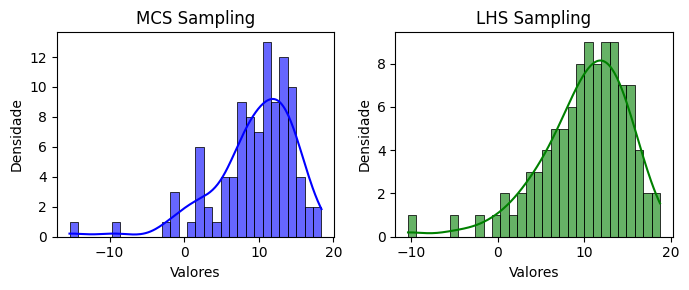

<!--Don't delete ths script-->
<script src = "https://polyfill.io/v3/polyfill.min.js?features=es6"></script>
<script id = "MathJax-script" async src="https://cdn.jsdelivr.net/npm/mathjax@3/es5/tex-mml-chtml.js"></script>
<!--Don't delete ths script-->

<h3>Gumbel Min Sampling</h3>
<p align="justify">
    This function generates random samples from a Gumbel minimum distribution with a specified mean (<code>mu</code>) and standard deviation (<code>sigma</code>), using the specified sampling method.
</p>

```python
u = gumbel_min_sampling(parameters, method, n_samples, seed)
```

Input variables
{: .label .label-yellow }

<table style="width:100%">
    <thead>
      <tr>
        <th>Name</th>
        <th>Description</th>
        <th>Type</th>
      </tr>
    </thead>
    <tr>
        <td><code>parameters</code></td>
        <td>
            <p align="justify">
            Dictionary of parameters for the Gumbel minimum distribution. Keys:
            <ul>
                <li><code>'mean'</code>: Mean of the distribution [Float]</li>
                <li><code>'sigma'</code>: Standard deviation of the distribution [Float]</li>
            </ul>
            </p>
        </td>
        <td>Dictionary</td>
    </tr>
    <tr>
        <td><code>method</code></td>
        <td>
            <p align="justify">Sampling method. Supports the following values:
            <ul>
                <li><code>'mcs'</code>: Crude Monte Carlo Sampling</li>
                <li><code>'lhs'</code>: Latin Hypercube Sampling</li>
            </ul>
            </p>
        </td>
        <td>String</td>
    </tr>
    <tr>
        <td><code>n_samples</code></td>
        <td>Number of samples to generate</td>
        <td>Integer</td>
    </tr>
    <tr>
        <td><code>seed</code></td>
        <td>Seed for random number generation. Use <code>None</code> for a random seed</td>
        <td>Integer or None</td>
    </tr>
</table>

Output variables
{: .label .label-yellow }

<table style="width:100%">
   <thead>
     <tr>
       <th>Name</th>
       <th>Description</th>
       <th>Type</th>
     </tr>
   </thead>
   <tr>
       <td><code>u</code></td>
       <td>Generated random samples from a Gumbel minimum distribution</td>
       <td>List</td>
   </tr>
</table>

<p align="justify" id="methods"></p>
<center>
    <p align="center"><b>Table 1.</b> Sampling methods (<code>method</code> key).</p>
    <table style="width:100%">
        <thead>
        <tr>
            <th>Method</th>
            <th>Syntax and Description</th>
            <th>Example</th>
        </tr>
        </thead>
        <tr>
            <td>Crude Monte Carlo Sampling</td>
            <td>
                <ul>
                    <li>Generates random samples uniformly distributed between 0 and 1</li>
                    <li>Transforms the uniform samples into Gumbel samples using the inverse CDF</li>
                    <li>Uses <code>crude_sampling_zero_one</code> function</li>
                </ul>
            </td>
            <td><code>method = 'mcs'</code></td>
        </tr>
        <tr>
            <td>Latin Hypercube Sampling</td>
            <td>
                <ul>
                    <li>Divides the domain into equal intervals and samples randomly within each interval</li>
                    <li>Transforms the uniform samples into Gumbel samples using the inverse CDF</li>
                    <li>Uses <code>lhs_sampling_zero_one</code> function</li>
                </ul>
            </td>
            <td><code>method = 'lhs'</code></td>
        </tr>
    </table>
</center>
<p align="justify">
    The Gumbel distribution parameters are calculated as follows:
    <ul>
        <li><code>gamma</code>: Euler-Mascheroni constant (approximately 0.5772)</li>
        <li><code>beta</code>: Scale parameter, computed as <code>np.pi / (np.sqrt(6) * sigma)</code></li>
        <li><code>alpha</code>: Location parameter, computed as <code>mean + gamma / beta</code></li>
    </ul>
</p>
<p align="justify">
    The Gumbel minimum samples are generated using the inverse CDF formula:
    <code>u[i] = alpha + (1 / beta) * log(-log(1 - u_aux[i]))</code>, where <code>u_aux[i]</code> is the sampled uniform value.
</p>

Example 1
{: .label .label-blue }

<p align="justify">
    <i>In this example, we use the <code>gumbel_min_sampling</code> function to generate two sets of random samples \((n=100)\) following a Gumbel distribution with a location parameter \(\mu = 10\) and a scale parameter \(\sigma = 5\). The first set is sampled using the Monte Carlo Sampling (MCS) method, while the second set is generated using the Latin Hypercube Sampling (LHS) method. The results are visualized using histograms with Kernel Density Estimates (KDE) plotted side-by-side for comparison. This comparison helps to illustrate how the two sampling methods affect the distribution of the generated data.</i>
</p>

```python
from parepy_toolbox import gumbel_min_sampling

# Sampling
n = 100
x = gumbel_min_sampling({'mean': 10, 'sigma': 5}, 'mcs', n)
y = gumbel_min_sampling({'mean': 10, 'sigma': 5}, 'lhs', n)

# PLot
fig, axes = plt.subplots(1, 2, figsize=(7, 3))

# First plot: Histogram and KDE for data1
sns.histplot(x, kde=True, bins=30, color='blue', ax=axes[0], alpha=0.6, edgecolor='black')
axes[0].set_title('MCS Sampling')
axes[0].set_xlabel('Valores')
axes[0].set_ylabel('Densidade')

# Second plot: Histogram and KDE for data2
sns.histplot(y, kde=True, bins=30, color='green', ax=axes[1], alpha=0.6, edgecolor='black')
axes[1].set_title('LHS Sampling')
axes[1].set_xlabel('Valores')
axes[1].set_ylabel('Densidade')

# Ajust and show plot
plt.tight_layout()
plt.show()
```
<center>
    
    <p align="center"><b>Figure 1.</b> Gmin variable example.</p>
</center>