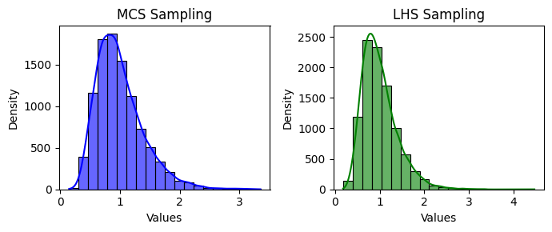

<!--Don't delete ths script-->
<script src = "https://polyfill.io/v3/polyfill.min.js?features=es6"></script>
<script id = "MathJax-script" async src="https://cdn.jsdelivr.net/npm/mathjax@3/es5/tex-mml-chtml.js"></script>
<!--Don't delete ths script-->

<p align="justify">
    This function generates a Lognormal distribution with a specified mean \(\mu\) and standard deviation \(\sigma\).
</p>

```python
u = lognormal_sampling(parameters, method, n_samples, seed)
```

Input variables
{: .label .label-yellow }

<table style="width:100%">
    <thead>
      <tr>
        <th>Name</th>
        <th>Description</th>
        <th>Type</th>
      </tr>
    </thead>
    <tr>
        <td><code>parameters</code></td>
        <td>
            <p align="justify">
            Dictionary of parameters for the Lognormal distribution. Keys:
            <ul>
                <li><code>'mean'</code>: Mean [float]</li>
                <li><code>'sigma'</code>: Standard deviation [float]</li>
            </ul>
            </p>
        </td>
        <td>Dictionary</td>
    </tr>
    <tr>
        <td><code>method</code></td>
        <td>
            <p align="justify">Sampling method. Supports the following values:
            <ul>
                <li><code>'mcs'</code>: Crude Monte Carlo Sampling</li>
                <li><code>'lhs'</code>: Latin Hypercube Sampling</li>
            </ul>
            </p>
        </td>
        <td>String</td>
    </tr>
    <tr>
        <td><code>n_samples</code></td>
        <td>Number of samples</td>
        <td>Integer</td>
    </tr>
    <tr>
        <td><code>seed</code></td>
        <td>Seed for random number generation. Use <code>None</code> for a random seed</td>
        <td>Integer or None</td>
    </tr>
</table>

Output variables
{: .label .label-yellow }

<table style="width:100%">
   <thead>
     <tr>
       <th>Name</th>
       <th>Description</th>
       <th>Type</th>
     </tr>
   </thead>
   <tr>
       <td><code>u</code></td>
       <td>Random samples</td>
       <td>List</td>
   </tr>
</table>

Example 1
{: .label .label-blue }

<p align="justify">
    <i>
        In this example, we will use the <code>lognormal_sampling</code> function from the <code>parepy_toolbox</code> to generate two random samples (\(n=400\)) following a Lognormal distribution. The first set is sampled using the Monte Carlo Sampling (MCS) method, and the second using the Latin Hypercube Sampling (LHS) method. The mean and standard deviation are defined as \([1.0, 0.4]\). The results are visualized using histograms with Kernel Density Estimates (KDE) plotted (using matplotlib lib) side-by-side for comparison.
    </i>
</p>

```python
# Library
import matplotlib.pyplot as plt

from parepy_toolbox import lognormal_sampling

# Sampling
n = 400
x = lognormal_sampling({'mean': 1.0, 'sigma': 0.4}, 'mcs', n)
y = lognormal_sampling({'mean': 1.0, 'sigma': 0.4}, 'lhs', n)

# Plot
fig, axes = plt.subplots(1, 2, figsize=(7, 3))
sns.histplot(x, kde=True, bins=30, color='blue', ax=axes[0], alpha=0.6, edgecolor='black')
axes[0].set_title('MCS Sampling')
axes[0].set_xlabel('Values')
axes[0].set_ylabel('Density')
sns.histplot(y, kde=True, bins=30, color='green', ax=axes[1], alpha=0.6, edgecolor='black')
axes[1].set_title('LHS Sampling')
axes[1].set_xlabel('Values')
axes[1].set_ylabel('Density')
plt.tight_layout()
plt.show()
```

<center>
    
    <p align="center"><b>Figure 1.</b> Lognormal variable example.</p>
</center>

Example 2
{: .label .label-blue }

<p align="justify">
    <i>
    In this example, we will use the <code>lognormal_sampling</code> function from the <code>parepy_toolbox</code> to generate two random samples (\(n=3\)) following a Lognormal distribution. Using the Monte Carlo algorithm and the specific seed (<code>seed=25</code>), we generated 3 times and compared the results.
    </i>
</p>

```python
from parepy_toolbox import lognormal_sampling

# Sampling
n = 3
x0 = lognormal_sampling({'mean': 1.0, 'sigma': 0.4}, 'mcs', n, 25)
x1 = lognormal_sampling({'mean': 1.0, 'sigma': 0.4}, 'mcs', n, 25)
x2 = lognormal_sampling({'mean': 1.0, 'sigma': 0.4}, 'mcs', n, 25)
print(x0, '\n', x1, '\n', x2)
```

<p align = "justify">
    <i>Output details.</i>
</p>

```bash
[0.6060493388543875, 1.613348026589917, 0.8213467995763253] 
[0.6060493388543875, 1.613348026589917, 0.8213467995763253]
[0.6060493388543875, 1.613348026589917, 0.8213467995763253] 
```

{: .important }
> Note that using the seed 25 by 3 times, we can generate the same values in a random variable.
