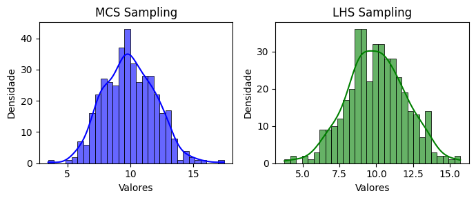

<!--Don't delete ths script-->
<script src = "https://polyfill.io/v3/polyfill.min.js?features=es6"></script>
<script id = "MathJax-script" async src="https://cdn.jsdelivr.net/npm/mathjax@3/es5/tex-mml-chtml.js"></script>
<!--Don't delete ths script-->

<h3>Normal Sampling</h3>
<p align="justify">
    This function generates random samples from a normal distribution with a specified mean \(\mu\) and standard deviation \(\sigma\).
</p>

```python
u = normal_sampling(parameters, method, n_samples, seed)
```

Input variables
{: .label .label-yellow }

<table style="width:100%">
    <thead>
      <tr>
        <th>Name</th>
        <th>Description</th>
        <th>Type</th>
      </tr>
    </thead>
    <tr>
        <td><code>parameters</code></td>
        <td>
            <p align="justify">
            Dictionary of parameters for the normal distribution. Keys:
            <ul>
                <li><code>'mean'</code>: Mean [float]</li>
                <li><code>'sigma'</code>: Standard deviation [float]</li>
            </ul>
            </p>
        </td>
        <td>dictionary</td>
    </tr>
    <tr>
        <td><code>method</code></td>
        <td>
            <p align="justify">Sampling method. Supports the following values:
            <ul>
                <li><code>'mcs'</code>: Crude Monte Carlo Sampling</li>
                <li><code>'lhs'</code>: Latin Hypercube Sampling</li>
            </ul>
            </p>
        </td>
        <td>string</td>
    </tr>
    <tr>
        <td><code>n_samples</code></td>
        <td>Number of samples</td>
        <td>integer</td>
    </tr>
    <tr>
        <td><code>seed</code></td>
        <td>Seed for random number generation. Use <code>None</code> for a random seed</td>
        <td>integer or None</td>
    </tr>
</table>

Output variables
{: .label .label-yellow }

<table style="width:100%">
   <thead>
     <tr>
       <th>Name</th>
       <th>Description</th>
       <th>Type</th>
     </tr>
   </thead>
   <tr>
       <td><code>u</code></td>
       <td>Random samples</td>
       <td>list</td>
   </tr>
</table>

<p align="justify" id="methods"></p>
<center>
    <p align="center"><b>Table 1.</b> Sampling methods (<code>method</code> key).</p>
    <table style="width:100%">
        <thead>
        <tr>
            <th>Method</th>
            <th>Sintax and description</th>
            <th>Example</th>
        </tr>
        </thead>
        <tr>
            <td>Crude Monte Carlo Sampling</td>
            <td>
                <ul>
                    <li>Generates random samples uniformly distributed between 0 and 1</li>
                    <li>Uses the Box-Muller transform to convert uniform samples into normal samples</li>
                    <li>Uses <code>crude_sampling_zero_one</code> function</li>
                </ul>
            </td>
            <td><code>method = 'mcs'</code></td>
        </tr>
        <tr>
            <td>Latin Hypercube Sampling</td>
            <td>
                <ul>
                    <li>Divides the domain into equal intervals and samples randomly within each interval</li>
                    <li>Uses the Box-Muller transform to convert uniform samples into normal samples</li>
                    <li>Uses <code>lhs_sampling_zero_one</code> function</li>
                </ul>
            </td>
            <td><code>method = 'lhs'</code></td>
        </tr>
    </table>
</center>

Example 1
{: .label .label-blue }

<p align="justify">
    <i>In this example, we use the <code>normal_sampling</code> function to generate two sets of random samples \((n=400)\) following a Normal distribution with a mean \(\mu = 10\) and a standard deviation \(\sigma = 2\). The first set is sampled using the Monte Carlo Sampling (MCS) method, while the second set is generated using the Latin Hypercube Sampling (LHS) method. Both sets are visualized using histograms with Kernel Density Estimates (KDE) plotted side-by-side for comparison. The plots help to illustrate how the sampling methods influence the distribution of the generated data.</i>
</p>

```python
from parepy_toolbox import normal_sampling

# Sampling
n = 400
x = normal_sampling({'mean': 10, 'sigma': 2}, 'mcs', n)
y = normal_sampling({'mean': 10, 'sigma': 2}, 'lhs', n)

# Plot
fig, axes = plt.subplots(1, 2, figsize=(7, 3))

# First plot: Histogram and KDE for data1
sns.histplot(x, kde=True, bins=30, color='blue', ax=axes[0], alpha=0.6, edgecolor='black')
axes[0].set_title('MCS Sampling')
axes[0].set_xlabel('Valores')
axes[0].set_ylabel('Densidade')

# Second plot: Histogram and KDE for data2
sns.histplot(y, kde=True, bins=30, color='green', ax=axes[1], alpha=0.6, edgecolor='black')
axes[1].set_title('LHS Sampling')
axes[1].set_xlabel('Valores')
axes[1].set_ylabel('Densidade')

# Ajust and show plot
plt.tight_layout()
plt.show()
```
<center>
    
    <p align="center"><b>Figure 1.</b> Normal variable example.</p>
</center>

Example 2
{: .label .label-blue }

<p align="justify">
    <i>In this example, we use the <code>normal_sampling</code> function to generate two sets of random samples \((n=100)\) following a Normal distribution with a mean \(\mu = 10\) and a standard deviation \(\sigma = 2\). The first set is sampled using the Latin Hypercube Sampling (LHS) method with a specified seed value of 24, ensuring reproducibility. The second set is generated with the same method, but without specifying a seed. The generated samples are then printed for comparison, demonstrating how the seed affects the results of the sampling process.</i>
</p>

```python
from parepy_toolbox import normal_sampling

# Sampling
n = 100
x1 = normal_sampling({'mean': 10, 'sigma': 2}, 'lhs', n, 24)
x2 = normal_sampling({'mean': 10, 'sigma': 2}, 'lhs', n)
print(x1, '\n', x2)
```
````
[7.865589902331452, 4.2851987851073075, 15.303809327551644, 14.794403574789893, 14.693455634731695, 5.222521702136648, 14.700059509212064, 11.229360388044721, 10.638756072622456, 5.72817077150256, 14.261862733376216, 10.424421416596719, 6.9024639102411935, 6.0326660730868875, 6.528080160846677, 8.972604054317367, 6.7762326540280124, 10.841992313186726, 13.612167025250885, 12.640245349954988, 11.793349090138907, 13.112149151798924, 12.702654202454982, 9.812634716687695, 7.649931847142971, 7.462364491307785, 10.967649698739978, 8.535948223296973, 13.043129560544315, 8.76745037607809, 9.699873895895479, 8.214326435488257, 7.010362903984867, 11.305829705816711, 8.028432756152174, 7.137447301389651, 7.372171858212435, 10.374223742551292, 8.9286636794742, 9.149833493834588, 7.604739207373374, 7.467653859632664, 8.353690553305269, 7.467556783559504, 8.884622652563667, 12.02811266574857, 10.052258451750369, 12.209975198393753, 12.357896922738679, 11.369163655887975, 8.440216487870162, 8.054237000623392, 9.354650721917388, 11.163751341795717, 10.539640029931922, 12.15689419714913, 11.841185012414849, 10.727725388784672, 7.9465604106377805, 11.310282207021682, 8.738449690341465, 11.457331165346803, 9.051776147817229, 11.915395114670329, 10.192556427042438, 8.67965474573424, 11.56538407373956, 11.712863315010994, 11.055573942165129, 8.40542484152362, 8.623613694285371, 11.486015432113678, 8.460690827068202, 9.1236944436092, 11.023749095211356, 8.777439597815583, 8.652245131976692, 9.286502012031285, 9.994729117220626, 10.543908730819807, 8.964074567604417, 11.033692336652889, 10.453466455627549, 10.557794222750164, 10.818009140371883, 10.06209391686073, 9.877525432378667, 11.019822501109479, 9.212453332476953, 10.585103356803849, 10.483489234101253, 10.769136293395102, 9.850439252263218, 10.284790630878781, 9.871957639252106, 10.485939424680463, 9.499213943466748, 10.307219435775806, 9.925654559878097, 9.964321554554374] 
 [12.066413532493112, 13.455945946753257, 14.431520472836969, 8.949668180987999, 14.90871477982731, 13.588892459308815, 14.142599379353449, 5.525740173046168, 11.97006448022014, 10.012767364864091, 10.81684853129557, 6.012340268467647, 10.285852932437741, 11.93157690309741, 12.574209950508303, 13.618613447255948, 9.832185841728164, 8.335020893654063, 13.501988281013054, 13.600176002142009, 12.51275336264785, 7.056338929966824, 12.950248645259354, 8.26361455616617, 11.279536284806198, 9.404753578158473, 11.800304973857452, 6.815538369574907, 12.920555724683982, 7.874918923524435, 12.291378653436496, 12.977749210332346, 12.953291878220787, 10.140098082935761, 7.619826364298406, 11.08827117908653, 11.713813888872423, 7.221253162085635, 7.244130380269353, 7.527128479458816, 7.33739948103794, 9.181283330079747, 10.846631121152743, 11.99210998980219, 8.664604604018908, 8.941436565918412, 9.313060978027544, 9.654656562878657, 7.922631605506768, 7.679969659637784, 8.314914343263522, 12.242700005315074, 8.039155080613847, 11.426069093807524, 7.8867782100963275, 8.373311154568592, 10.63231532278586, 8.11313742858582, 9.913088310974384, 10.617957051930594, 8.58697999382946, 11.97934528091818, 11.868314073233392, 11.327199644708418, 8.51603894338532, 8.80856139181122, 11.007442109394068, 10.427444580527512, 10.326616846102906, 8.986739272882826, 9.00982057608849, 8.563556564613396, 8.469368626774152, 9.882660170078447, 11.294278464276983, 9.13882027400027, 10.72770575484414, 8.861129528824664, 11.386605571585152, 9.910061981349319, 10.668659872379685, 9.628649004119216, 11.216026495144693, 8.840726568247433, 9.63370596774913, 11.02879768253034, 9.39511602703111, 10.173067225566873, 9.024283660473248, 10.743728799551242, 9.818824281258502, 9.660517947608493, 9.272193312099596, 9.345266622079183, 10.053812481042229, 9.564046402503335, 10.465775580891648, 10.418119543322755, 10.352601512469807, 9.950962664159327]
````
