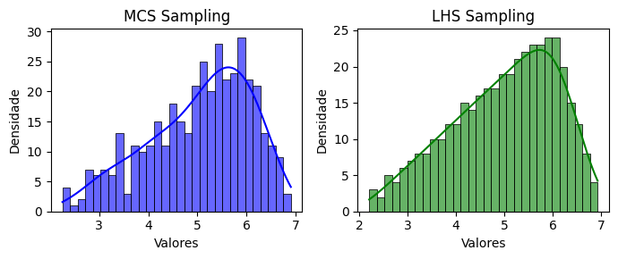

<!--Don't delete ths script-->
<script src = "https://polyfill.io/v3/polyfill.min.js?features=es6"></script>
<script id = "MathJax-script" async src="https://cdn.jsdelivr.net/npm/mathjax@3/es5/tex-mml-chtml.js"></script>
<!--Don't delete ths script-->

<p align="justify">
    This function generates a triangular sampling with minimun \(a\), mode \(c\), and maximum \(b\).
</p>

```python
u = triangular_sampling(parameters, method, n_samples, seed)
```

Input variables
{: .label .label-yellow }

<table style="width:100%">
    <thead>
      <tr>
        <th>Name</th>
        <th>Description</th>
        <th>Type</th>
      </tr>
    </thead>
    <tr>
        <td><code>parameters</code></td>
        <td>
            <p align="justify">
            Dictionary of parameters for the triangular distribution. Keys:
            <ul>
                <li><code>'min'</code>: Minimum value of the distribution [float]</li>
                <li><code>'mode'</code>: Mode (most likely value) of the distribution [float]</li>
                <li><code>'max'</code>: Maximum value of the distribution [float]</li>
            </ul>
            </p>
        </td>
        <td>dictionary</td>
    </tr>
    <tr>
        <td><code>method</code></td>
        <td>
            <p align="justify">Sampling method. Supports the following values:
            <ul>
                <li><code>'mcs'</code>: Crude Monte Carlo Sampling</li>
                <li><code>'lhs'</code>: Latin Hypercube Sampling</li>
            </ul>
            </p>
        </td>
        <td>string</td>
    </tr>
    <tr>
        <td><code>n_samples</code></td>
        <td>Number of samples to generate</td>
        <td>integer</td>
    </tr>
    <tr>
        <td><code>seed</code></td>
        <td>Seed for random number generation. Use <code>None</code> for a random seed</td>
        <td>integer or none</td>
    </tr>
</table>

Output variables
{: .label .label-yellow }

<table style="width:100%">
   <thead>
     <tr>
       <th>Name</th>
       <th>Description</th>
       <th>Type</th>
     </tr>
   </thead>
   <tr>
       <td><code>u</code></td>
       <td>Random samples</td>
       <td>list</td>
   </tr>
</table>

Example 1
{: .label .label-blue }

<p align="justify">
    <i>
        In this example, we will use the triangular_sampling function from the parepy_toolbox to generate two sets of random samples (\(n=400\)) following a triangular distribution. The first set is sampled using the Monte Carlo Sampling (MCS) method, and the second using the Latin Hypercube Sampling (LHS) method. Minimum, mode and maximum is defined as \([2, 6, 7]\). The results are visualized using histograms with Kernel Density Estimates (KDE) plotted (using matplotlib lib) side-by-side for comparison.
    </i>
</p>

```python
from parepy_toolbox import triangular_sampling

# Sampling
n = 400
x = triangular_sampling({'min': 2, 'mode': 6, 'max': 7}, 'mcs', n)
y = triangular_sampling({'min': 2, 'mode': 6, 'max': 7}, 'lhs', n)

# Plot
fig, axes = plt.subplots(1, 2, figsize=(7, 3))
sns.histplot(x, kde=True, bins=30, color='blue', ax=axes[0], alpha=0.6, edgecolor='black')
axes[0].set_title('MCS Sampling')
axes[0].set_xlabel('Valores')
axes[0].set_ylabel('Densidade')
sns.histplot(y, kde=True, bins=30, color='green', ax=axes[1], alpha=0.6, edgecolor='black')
axes[1].set_title('LHS Sampling')
axes[1].set_xlabel('Valores')
axes[1].set_ylabel('Densidade')
plt.tight_layout()
plt.show()
```

<center>
    
    <p align="center"><b>Figure 1.</b> Triangular variable example.</p>
</center>

Example 2
{: .label .label-blue }

<p align="justify">
    <i>
    In this example, we will use the <code>triangular_sampling</code> function from the <code>parepy_toolbox</code> to generate two sets of random samples (\(n=3\)) following a triangular distribution. Using the Monte Carlo algorithm and the specific seed (<code>seed=25</code>), we triangular sampling generate 3 times and compare results.
    </i>
</p>

```python
from parepy_toolbox import triangular_sampling

# Sampling
n = 3
x0 = triangular_sampling({'min': 2, 'mode': 6, 'max': 7}, 'mcs', n, 25)
x1 = triangular_sampling({'min': 2, 'mode': 6, 'max': 7}, 'mcs', n, 25)
x2 = triangular_sampling({'min': 2, 'mode': 6, 'max': 7}, 'mcs', n, 25)
print(x0, '\n', x1, '\n', x2)
```

```bash
[3.911914212156261, 2.763962517823044, 6.5574659216434235] 
[3.911914212156261, 2.763962517823044, 6.5574659216434235]
[3.911914212156261, 2.763962517823044, 6.5574659216434235] 
```

{: .important }
> Note that using the seed 25 by 3 times, we can generate the same values in a random variable.
