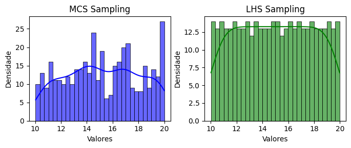

<!--Don't delete ths script-->
<script src = "https://polyfill.io/v3/polyfill.min.js?features=es6"></script>
<script id = "MathJax-script" async src="https://cdn.jsdelivr.net/npm/mathjax@3/es5/tex-mml-chtml.js"></script>
<!--Don't delete ths script-->


<h3>Uniform Sampling</h3>
<p align="justify">
    This function generates uniform sampling between two values, <code>a</code> and <code>b</code>, using specified sampling methods.
</p>

```python
u = uniform_sampling(parameters, method, n_samples, seed)
```

Input variables
{: .label .label-yellow }

<table style="width:100%">
    <thead>
      <tr>
        <th>Name</th>
        <th>Description</th>
        <th>Type</th>
      </tr>
    </thead>
    <tr>
        <td><code>parameters</code></td>
        <td>
            <p align="justify">
            Dictionary of parameters for uniform distribution. Keys:
            <ul>
                <li><code>'min'</code>: Minimum value of the uniform distribution [Float]</li>
                <li><code>'max'</code>: Maximum value of the uniform distribution [Float]</li>
            </ul>
            </p>
        </td>
        <td>Dictionary</td>
    </tr>
    <tr>
        <td><code>method</code></td>
        <td>
            <p align="justify">Sampling method. Supports the following values:
            <ul>
                <li><code>'mcs'</code>: Crude Monte Carlo Sampling</li>
                <li><code>'lhs'</code>: Latin Hypercube Sampling</li>
            </ul>
            </p>
        </td>
        <td>String</td>
    </tr>
    <tr>
        <td><code>n_samples</code></td>
        <td>Number of samples to generate</td>
        <td>Integer</td>
    </tr>
    <tr>
        <td><code>seed</code></td>
        <td>Seed for random number generation. Use <code>None</code> for a random seed</td>
        <td>Integer or None</td>
    </tr>
</table>

Output variables
{: .label .label-yellow }

<table style="width:100%">
   <thead>
     <tr>
       <th>Name</th>
       <th>Description</th>
       <th>Type</th>
     </tr>
   </thead>
   <tr>
       <td><code>u</code></td>
       <td>Generated random samples</td>
       <td>List</td>
   </tr>
</table>

<p align="justify" id="methods"></p>
<center>
    <p align="center"><b>Table 1.</b> Sampling methods (<code>method</code> key).</p>
    <table style="width:100%">
        <thead>
        <tr>
            <th>Method</th>
            <th>Sintax and description</th>
            <th>Example</th>
        </tr>
        </thead>
        <tr>
            <td>Crude Monte Carlo Sampling</td>
            <td>
                <ul>
                    <li>Generates random samples uniformly distributed between 0 and 1</li>
                    <li>Uses <code>crude_sampling_zero_one</code> function</li>
                </ul>
            </td>
            <td><code>method = 'mcs'</code></td>
        </tr>
        <tr>
            <td>Latin Hypercube Sampling</td>
            <td>
                <ul>
                    <li>Divides the domain into equal intervals and samples randomly within each interval</li>
                    <li>Uses <code>lhs_sampling_zero_one</code> function</li>
                </ul>
            </td>
            <td><code>method = 'lhs'</code></td>
        </tr>
    </table>
</center>

Example 1
{: .label .label-blue }

<p align="justify">
    <i>In this example, we will use the <code>uniform_sampling</code> function from the <code>parepy_toolbox</code> to generate two sets of random samples \((n=400)\) following a uniform distribution. The first set is sampled using the Monte Carlo Sampling (MCS) method, and the second using the Latin Hypercube Sampling (LHS) method. The range for both distributions is defined as \([10, 20]\). The results are visualized using histograms with Kernel Density Estimates (KDE) plotted side-by-side for comparison.</i>
</p>

```python
from parepy_toolbox import uniform_sampling

# Sampling
n = 400
x = uniform_sampling({'min': 10, 'max': 20}, 'mcs', n)
y = uniform_sampling({'min': 10, 'max': 20}, 'lhs', n)

# Plot
fig, axes = plt.subplots(1, 2, figsize=(7, 3))

# First plot: Histogram and KDE for data1
sns.histplot(x, kde=True, bins=30, color='blue', ax=axes[0], alpha=0.6, edgecolor='black')
axes[0].set_title('MCS Sampling')
axes[0].set_xlabel('Valores')
axes[0].set_ylabel('Densidade')

# Second plot: Histogram and KDE for data2
sns.histplot(y, kde=True, bins=30, color='green', ax=axes[1], alpha=0.6, edgecolor='black')
axes[1].set_title('LHS Sampling')
axes[1].set_xlabel('Valores')
axes[1].set_ylabel('Densidade')

# Ajust and show plot
plt.tight_layout()
plt.show()
```

<center>
    
    <p align="center"><b>Figure 1.</b> Uniform variable example.</p>
</center>

Example 2
{: .label .label-blue }

<p align="justify">
    <i>In this example, we use the <code>uniform_sampling</code> function from the <code>parepy_toolbox</code> to generate two sets of random samples \((n=100)\) following a uniform distribution with a specified range \([10, 20]\). The first set of samples is generated using the Monte Carlo Sampling (MCS) method with a seed value of 25, ensuring reproducibility. The second set is generated with the same method, but without specifying a seed. The generated samples are then printed for comparison.</i>
</p>

```python
from parepy_toolbox import uniform_sampling

# Sampling
n = 100
x1 = uniform_sampling({'min': 10, 'max': 20}, 'mcs', n, 25)
x2 = uniform_sampling({'min': 10, 'max': 20}, 'mcs', n)
print(x1, '\n\n', x2)
```
```
[11.607212332320078, 10.003120351710036, 12.16598464462817, 13.680292969901654, 10.020262080143022, 11.930828803676011, 19.90862178909207, 17.86934281826405, 11.21281127371162, 12.257713152101344, 17.668265518946733, 19.16838233365658, 13.538217142449822, 17.857072386313313, 11.467192679236016, 15.41728557015512, 15.968611609315305, 17.899008474120254, 12.78632275159974, 14.136335113470745, 13.76070856417623, 11.379084145985537, 16.75949845995527, 15.573594767814928, 15.061813277527001, 16.264120902151042, 16.05258732025803, 10.731561673251424, 12.997571004603794, 14.0333808597236, 11.883201861892031, 17.207735835733295, 16.74194300389733, 17.669632715654195, 10.161638079936502, 10.974222752299992, 12.440144934048623, 15.414900943930856, 10.774944183333222, 19.273024797593514, 10.295472647028546, 16.32057842406911, 17.623737823642685, 15.841762126594183, 13.852580639125174, 18.602498257117084, 12.953074764512321, 11.855456874948864, 15.513558908600181, 11.236892821842025, 10.828973854070583, 19.3756098681747, 14.74390293242776, 12.232522150899834, 17.009467600948184, 18.93321185547837, 10.845514279834639, 14.108095613840387, 13.301522276539984, 18.97546032161069, 11.795452165352868, 12.747519241755555, 10.819067109028948, 16.149599397452516, 12.057704294536205, 16.722334596646256, 12.449917462679366, 18.365384852113078, 17.118506034458445, 19.282723148222267, 14.27998511673497, 11.61951083065993, 19.4405435747, 16.41750011443333, 19.086285672538736, 14.975960694251825, 17.708329414209135, 14.926161561168136, 13.452008380904886, 17.429428890799127, 12.430271596929073, 10.82587939977459, 14.54000543863361, 10.080748009562686, 10.239300280233552, 17.18955483511285, 14.966343046942773, 11.488242180621093, 16.1820851786088, 14.476614289039563, 12.63992906935586, 13.00600445843307, 17.786488679147524, 12.846645534164093, 10.711379088685373, 19.325493642055086, 12.80189361724057, 15.539976207700255, 14.374944252328358, 19.084550378847155] 
 [16.134708000398646, 11.56943702123476, 12.935843854351265, 11.38448169400875, 14.862342619945244, 15.79733304025546, 18.09602778559123, 14.28591595293584, 12.635264083496285, 17.345682975337933, 18.45507986790647, 19.265263789131026, 18.933551887836266, 13.728123373428467, 14.670305932105304, 19.810448234435604, 10.605464111274335, 12.42601451739192, 11.455399504115238, 12.027076215990842, 15.856498037487171, 10.396803411426305, 19.142009450413482, 11.048648413772039, 12.733304674047366, 12.431002301877946, 10.655929581444871, 18.912017365887138, 17.761529936651108, 10.696178614180162, 12.218607119278321, 18.5651997514204, 11.45227983820726, 15.431736774581058, 12.949544124196011, 11.99906307159981, 11.088989651418206, 12.978076218726581, 18.854480159844677, 13.321452498978136, 11.901409512858223, 13.540431454207406, 15.61067573025741, 11.761519303303459, 17.41999035643165, 18.379440709975036, 18.47009901166681, 15.948899011829452, 19.961341956215207, 15.256390118326886, 14.107920046232929, 11.360880158653494, 11.5603857806859, 19.35026417232405, 19.299317447033946, 12.734158617717156, 17.555785329260647, 15.190527791036269, 18.43323205909156, 10.522100237322071, 10.704952081966791, 13.791508384639616, 11.492027347206015, 13.322901078202289, 17.87292628319171, 19.454446957412614, 18.60713264823594, 14.825991292647451, 11.85188121691916, 12.542271212420316, 16.62434222520798, 13.628460662757997, 11.177532391836401, 16.030713929503086, 17.447501002270755, 19.48737054561639, 10.838318584397607, 14.63247003837634, 19.102664206966583, 15.488145682334304, 14.370988944774746, 11.106702919251378, 18.856706555306236, 19.267260444083554, 12.719634483094815, 11.700702852869359, 12.19916453511349, 13.569972562698432, 13.89563947801701, 12.02922327796594, 14.879576150043246, 14.489132867122784, 13.899044683080287, 17.707941723483472, 15.055523476700557, 17.806371983909546, 15.771903879504205, 15.10857005638968, 10.657921424894404, 10.026505556372248]
```