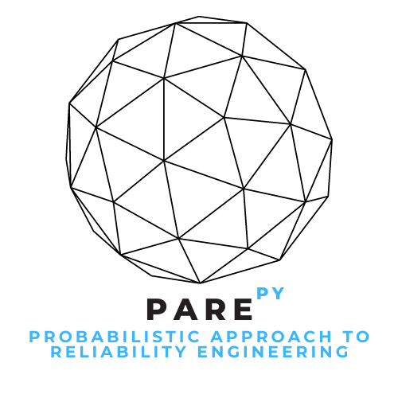

<table>
  <tr>
    <td style="width:70%;">
The PAREpy (<b>Probabilistic Approach to Reliability Engineering</b>) framework is a software developed by the research group headed by <a href="http://lattes.cnpq.br/2268506213083114" target="_blank" rel="noopener noreferrer">Professor Wanderlei M. Pereira Junior</a> in Engineering College at Universidade Federal de Catalão. It is a framework for applying probabilistic concepts to analyze a system containing random variables. The platform is built in Python and can be used in any environment that supports this programming language.
</td>
    <td style="width:50%;"></td>  
  </tr>
</table>  

{: .note-title }
> Suggestions  
>
> If you have any suggestions or error reports regarding the algorithm's functioning, please email us at `wanderlei_junior@ufcat.edu.br`. We will be happy to improve the framework.

{: .highlight-title }
> Team
>
> [Prof. PhD Wanderlei Malaquias Pereira Junior](http://lattes.cnpq.br/2268506213083114)  
> [Prof. PhD Daniel de Lima Araújo](http://lattes.cnpq.br/8801080897723883)  
> [Prof. PhD André Teófilo Beck](http://lattes.cnpq.br/4319075758352865)  
> [Prof. PhD André Luis Christoforo](http://lattes.cnpq.br/7623383075429186)  
> [Prof. PhD Iuri Fazolin Fraga](http://lattes.cnpq.br/3180484792983028)  
> [Prof. PhD Marcos Napoleão Rabelo](http://lattes.cnpq.br/0067281135180613)  
> [Prof. PhD Marcos Luiz Henrique](http://lattes.cnpq.br/3103828419121683)  
> [Prof. PhD Ketson Roberto Maximiano dos Santos](https://cse.umn.edu/dsi/ketson-r-m-dos-santos)  
> [Msc. Murilo Carneiro Rodrigues](http://lattes.cnpq.br/6429652195589650)   
> [Msc. Matheus Henrique Morato Moraes](http://lattes.cnpq.br/8465474056220474)   
> [Academic Luiz Henrique Ferreira Rezio](http://lattes.cnpq.br/7410596508180181)

{: .new-title }
> Version 
>
> [2.0.1](https://pypi.org/project/parepy-toolbox/#history)
