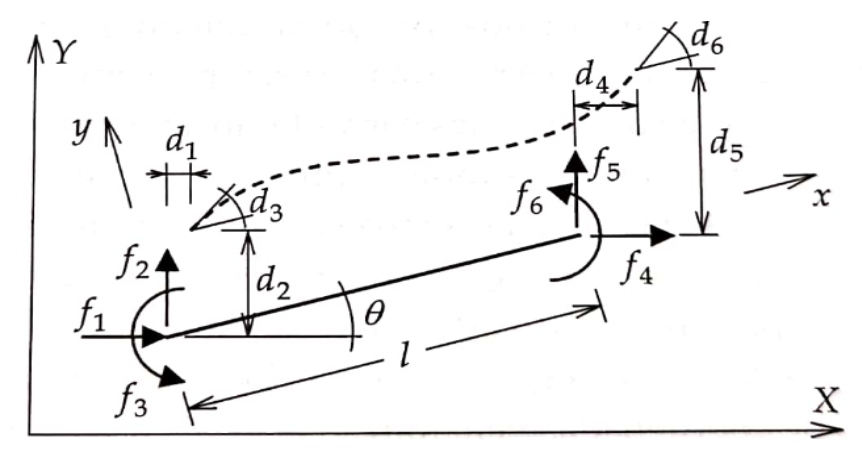

<!--Don't delete this script-->

<!--Don't delete this script-->

<h1>Reliability analysis of reinforced concrete frames subjected to post-construction settlements</h1>

Análise de confiabilidade de pórticos em concreto armado sujeitos a recalques pós construção

    

        <b>Wanderlei Malaquias Pereira Junior</b>a 
        <a href="https://orcid.org/0000-0002-7404-3666" target="_blank">https://orcid.org/0000-0002-7404-3666</a> 
        <b>Matheus Henrique Morato de Moraes</b>b 
        <a href="https://orcid.org/0000-0002-7285-1344" target="_blank">https://orcid.org/0000-0002-7285-1344</a> 
        <b>Daniel Lima de Araújo</b>c 
        <a href="https://orcid.org/0000-0002-6802-4637" target="_blank">https://orcid.org/0000-0002-6802-4637</a> 
        <b>Mauro Alexandre Paula de Sousa</b>b 
        <a href="https://orcid.org/0000-0002-5798-8553" target="_blank">https://orcid.org/0000-0002-5798-8553</a> 
        <b>Antover Panazzolo Sarmento</b>c 
        <a href="https://orcid.org/0000-0002-8533-1575" target="_blank">https://orcid.org/0000-0002-8533-1575</a> 
        <b>André Teófilo Beck</b>d 
        <a href="https://orcid.org/0000-0003-4127-5337" target="_blank">https://orcid.org/0000-0003-4127-5337</a>
    

    

        aFederal University of Catalão - UFCAT, Engineering College, Department of Civil Engineering, Catalão, Goiás, Brasil 
        bFederal University of São Carlos - UFSCar, Civil Engineering Graduate Program, Department of Civil Engineering, São Carlos, São Paulo, Brasil 
        cFederal University of Goiás - UFG, Department of Civil Engineering, Goiânia, Goiás, Brasil 
        dUniversity of São Paulo - USP, Engineering School, Department of Engineering Structures, São Carlos, São Paulo, Brasil
    

<b>Abstract:</b> Most papers found in the literature address reliability analysis of isolated elements, like beams and columns. Yet, symmetry and regularity are often exploited in the construction of regular RC frames, resulting in the same or similar designs for all columns of a floor, and for all beams of a building. This leads to significant differences in member reliability, due to different axial load to bending moment ratios, in different parts of the structure. Moreover, load effects increase and symmetry is lost under individual support settlements. In this scenario, reliability analyses are performed, for an intact 4-story 4-bays RC frame; and considering different settlement conditions. Monte Carlo simulation is performed, considering uncertainties in dead and life loading, and steel and concrete strengths. The results show that a settlement of 5 mm, corresponding to an angular distortion of 1/1000, reduced the average reliability of the frame by only 7%, just the same, it reduced the reliability index of several cross-sections of the beams to up to 2.65,

<b>Keywords:</b> reinforced concrete, reliability analysis, Monte Carlo simulation, foundation settlements.

<b>Resumo:</b> A maior parte dos artigos encontrados na literatura endereça a confiabilidade de elementos isolados, como vigas e colunas. No entanto, simetria e regularidade são frequentemente exploradas na construção de pórticos regulares de concreto armado, o que resulta em projetos iguais ou semelhantes para todas as colunas de um andar, ou para todas as vigas de um prédio. Isto leva a diferenças na confiabilidade dos elementos, em função das diferentes razões entre carga axial e momento fletor, em diferentes partes da estrutura. Mais ainda, há um aumento dos esforços solicitantes e perda de simetria na presença de recalques de apoios. Neste cenário são realizadas análises de confiabilidade para um pórtico de 4 andares e 4 vãos, na situação intacta e considerando diferentes recalques de apoio. É realizada simulação de Monte Carlo, considerando incertezas nas ações permanentes e de utilização, e na resistência do aço e do concreto. 
  
Os resultados mostram que um recalque de 5 mm, correspondente a uma distorção angular de 1/1000, reduziu a confiabilidade média do pórtico em apenas 7%, contudo reduziu o índice de confiabilidade de várias seções transversais das vigas para até 2.65, valor inferior ao recomendado no Model Code 2010. Conclui-se que a metodologia utilizada neste artigo apresenta-se como uma ferramenta importante para a análise de eventos não previstos em projeto, auxiliando na tomada de decisão sobre a necessidade de intervenção nas estruturas.
  
<b>Palavras-chave:</b> concreto armado, confiabilidade estrutural, simulação de Monte Carlo, recalque de fundações. 

<h3>How to cite:</h3>
    

        W. M. Pereira Junior, M. H. M. Moraes, D. L. Araújo, M. A. P. Sousa, A. P. Sarmento, A. T. Beck: 
        “Reliability analysis of reinforced concrete reticulated structures subjected to post-construction settlements” 
        <i>Rev. IBRACON Estrut. Mater.</i>, vol. xx, no. xx, 
        elocation, year, <a href="https://doi.org/" target="_blank" class="red-text">https://doi.org/...</a>  
        [Items in red will be filled in later by the journal staff]
    

<b>Corresponding author:</b> First Name Surname. E-mail: <a href="mailto:email@email.com">email@email.com</a>

<b>Financial support:</b> None.

<b>Conflict of interest:</b> Nothing to declare.

<h2>1. Introduction</h2>

In the structural engineering context, uncertainties are related to the inability to predict some characteristics of the structural system, such as loads, material properties, and assumptions of the structural model adopted [1], [2]. Despite these uncertainties, design codes employ design methodologies to obtain a resistant, safe and robust structure.
  
Although the design of structures considers these uncertainties in the design variables, it is still possible that a structure will be exposed to a condition not foreseen in the design [3]. Given these new conditions in the service situation, it is necessary to evaluate the new safety level of the structure, verifying the necessity of reinforcements or even the demolition of the system in more severe cases.
  
In terms of assessing the safety level of an existing structure, reliability theory can be employed for this purpose. Some authors have dedicated themselves to studying and evaluating the safety level of existing structures using such a theory. Works such as Facholli and Beck [4] and Beck et al. [5] have employed reliability theory to evaluate the safety level in structural element loss events. Küttenbaum et al.[6], Mankar et al. [7] and Souza et al. [8] evaluated the variations of the mechanical properties of materials and their impact on the system’s reliability in situations of structure use. In Ávilla et al. [9] reliability analysis was applied to verify the safety level of historic buildings in regions susceptible to earthquakes.
  
In terms of structural design, many engineers still design structures without considering the effects of settlement [10]. Amancio [11] states that such a condition often occurs since predicting settlements in structures is still a complex factor due to the difficulty of obtaining parameters such as soil strength and deformability. Thus, this paper aims to contribute to the soil-structure interaction theme by developing a conceptual study to verify the influence of settlements on the safety of reinforced concrete reticulated structures. Therefore, this work intends to develop an analysis methodology that can contribute to decision-making regarding the maintenance of reinforced concrete structures of multiple floors submitted to actions arising from foundation settlement.
  
This paper is divided into six sections. The first three sections introduce the initial concepts of beam design and structural reliability. Section 4 discusses the conceptual problem of a frame structure submitted to settlement conditions. Sections 5 and 6 present the results and conclusions about this research.

<h2>2. DESIGN OF BEAMS UNDER PURE BENDING</h2>

This section presents the concepts related to structural analysis and the format of the limit state equation. The normative used were the Brazilian standards NBR 8681 [12] and NBR 6118 [13].
  
The rectangular beams considered in this work are subject to pure bending caused by the action of gravitational loads. Equation (1) characterizes the ultimate limit state (g) of the beam by the exhaustion of the resistant capacity of the cross-section at stage III due to normal loads, as defined by NBR 6118 [13]. 

$$
\begin{align*}
    g(f_y, f_c, D, L) = E_R \cdot M_R(f_y, f_c) - M_S(D, L, f'_c) \quad{(1)} \\
    M_R = A_S \cdot f_y \cdot (d - \frac{\lambda}{2} \cdot x) \quad{(2)} \\
    x = \frac{A_S \cdot f_y}{f_c \cdot b_w \cdot \alpha_c \cdot \lambda} \quad{(3)}
\end{align*}
$$

The requesting moment \(M_S\) indicates the maximum demand of bending moment on the cross-section, and in the case of this work, it was determined using a linear analysis. The resistant moment \(M_R\) indicates the resistant capacity of the cross-section of the reinforced concrete (RC) beam. \(A_s\) represents the steel’s area of the section, \(\lambda\) and \(\alpha_c\) are factors that depend on the characteristic compressive strength of concrete (\(f_c)\). These factors can be consulted in section 17.2.2 of NBR 6118 [13]. \(f_y\) represents the yield strength of the passive reinforcement steel used. \(d\) and \(b_w\) represent the effective height and width of the RC section. \(E_R\) represents model error variable for beam bending.

<h2>2.1 Determination of internal loads</h2>

The effects of the loads on the frames studied are evaluated by employing a linear-elastic static analysis. The mechanical model is based on the matrix analysis of structures, with frame-type elements (see Figure 1) and three degrees of freedom per node. Static linear analysis is sufficient for an approximate study of the load distribution in frame structures, allowing the redistribution of loads once the equilibrium and ductility conditions of NBR 6118 [13] are satisfied. However, in this paper, the analyses were performed without considering the redistribution of internal forces.
  
The nodal displacement vector d is obtained by a system containing the global stiffness matrix K and the external forces vector (\(f\)). Thus, the system of equations that represents the discretized structural system will be given by equation (4).

$$
K \cdot d = f \quad{(4)}
$$

    
    
<b>Figure 1.</b> Frame element.

<h2>3. STRUCTURAL RELIABILITY AND MONTE CARLO METHOD</h2>

In this section, the basic concepts of the reliability evaluation of a structure are presented. The Monte Carlo method, the reliability procedure employed in the analyses, are presented.
  
The basic reliability problem is represented by the multiple integral of equation (5), where \(p_f\) represents the failure probability of the structure, \(X\) is the n-dimensional vector representing the random variables of the system, \(f_x(x)\) represents the joint probability density function over the failure domain, and \(G(X)\) is the limit state equation.  \(G(X) ≤ 0\) represents a failure condition.

$$
p_f = P(G(X) ≤ 0) = \int ... \int_{G(X) ≤ 0} f_x(x) dx \quad{(5)} 
$$

The probability of failure is a complementary concept to structural reliability. Structural failure probability measures of the propensity of a structure or structural system to fail to satisfy the technical design requirements (function, strength, equilibrium) within a specified design life, respecting the operational and design conditions [2]. 
  
Several methods can be applied to solve equation (5). In the case of this work, the stochastic Monte Carlo method was applied. This algorithm was developed in the 1940s during the end of World War II and the beginning of the Cold War. It was initially employed by the mathematicians Stanislav Ulam and John von Neumann, who was working on developing the hydrogen bomb [14]. The model starts from the assumption of generating a random system of particles based on a given probability distribution.
  
There are several variations of the Monte Carlo method, the Simple Monte Carlo was used in this work, which consists of random tests with a certain number of samples. The failure probability calculation will be given by an approximation of equation (5). The estimation of the failure probability using the Monte Carlo method is given by equation (6). 

$$
\begin{align*}
    p_f = \frac{1}{n_s} \sum_{i=1}^{n_s} I[G(X)] = \frac{n_f}{n_s} \quad{(6)} \\
    I[G(X)] = \begin{cases} 1, & \text{if } G(X_i) ≤ 0 \quad{(7)}\\ 0, & \text{otherwise} \quad{(8)} \end{cases}
\end{align*}
$$

In the case of equations (7) and (8), return 1 indicates failure of the Limit State function, i.e., it indicates that that structure has failed a due criterion, and return 0 indicates that the structure is in the safe evaluation region of the Limit State function. In equation (6), \(n_s\) indicates the number of samples and \(n_f\) indicates the number of system failure (IG(X)=1).
  
To ascertain the reliability measure (\(\beta_{MC}\)) of sampling, it is necessary to apply equation (9) which consists of the inverse function of the cumulative mean failure probability distribution (\(p_f\)). The numerical solution of this inverse function can be found in Beck [2].

$$
\beta_{MC} = \Phi(1 - p_f)\quad{(9)}
$$

<h2>4. MODELING THE FRAME THROUGH RELIABILITY</h2>

This section presents the characteristics of the structural model used in the reliability analysis of a frame structure subjected to differential settlement and the numerical method employed in the reliability analysis.
  
The example used to evaluate structural safety is a four floors plane frame, as described in Facholli and Beck [4]. Figure 2 presents the geometry of the structural frame, which has four spans of 5 meters and a floor height of 3 meters. Table 2 shows the cross-section values for each element represented in Figure 2. 

    
    
<b>Figure 2.</b> FPlane frame in reinforced concrete analyzed and nomenclature of the columns and beams.

<table>
    <title>Table 2. Geometric properties of the elements.</title>
    <tr>
        <th>Type</th>
        <th>Name</th>
        <th>\(b_w\) (cm)</th>
        <th>\(h\) (cm)</th>
    </tr>
    <tr>
        <td>Beam</td>
        <td>V1=V2=V3</td>
        <td>20</td>
        <td>45</td>
    </tr>
    <tr>
        <td>Beam</td>
        <td>V4</td>
        <td>20</td>
        <td>45</td>
    <tr>
        <td>Column</td>
        <td>P1=P4</td>
        <td>40</td>
        <td>20</td>
    </tr>
    <tr>
        <td>Column</td>
        <td>P3=P3</td>
        <td>50</td>
        <td>20</td>
    </tr>
</table>

The imposed frame settlements are shown in Table 3. The created patterns aim to realize an angular distortion (\(\gamma\)) between columns of the building. The calculation of the angular distortion is performed by equation (11). In Table 3 probabilities (\(p\)) of occurrence of each of the established types of settlements are also arbitrated. These probabilities (\(p\)) are based on performance-based design where higher intensity events have lower probability of occurrence as described in Beck[2].
  
It is worth noting, that the settlement’s values stipulated follow traditional bibliographies on the subject, such as Skempton and MacDonald [17], Das [18], and Burland et al. [19]. In addition, the angular distortions established in Table 3 range from a less aggressive scale of rotation-to-rotation values that induce severe damage to the structure studied.

