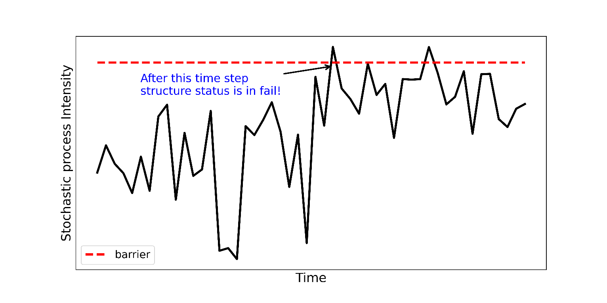

<!--Don't delete this script-->

<!--Don't delete this script-->

<h1>Structural Reliability and Monte Carlo Method</h1>

In this section, the basic concepts of the reliability evaluation of a structure are presented. The Monte Carlo method, the reliability procedure employed in the analyses, are presented.
  
The basic reliability problem is represented by the multiple integral of equation (1), where \(p_f\) represents the failure probability of the structure, \(X\) is the n-dimensional vector representing the random variables of the system, \(f_x(x)\) represents the joint probability density function over the failure domain, and \(G(X)\) is the limit state equation.  \(G(X) ≤ 0\) represents a failure condition.

$$
p_f = P(G(X) ≤ 0) = \int ... \int_{G(X) ≤ 0} f_x(x) dx \quad{(1)} 
$$

The probability of failure is a complementary concept to structural reliability. Structural failure probability measures of the propensity of a structure or structural system to fail to satisfy the technical design requirements (function, strength, equilibrium) within a specified design life, respecting the operational and design conditions [2]. 
  
Several methods can be applied to solve equation (1). In the case of this work, the stochastic Monte Carlo method was applied. This algorithm was developed in the 1940s during the end of World War II and the beginning of the Cold War. It was initially employed by the mathematicians Stanislav Ulam and John von Neumann, who was working on developing the hydrogen bomb [14]. The model starts from the assumption of generating a random system of particles based on a given probability distribution.
  
There are several variations of the Monte Carlo method, the Simple Monte Carlo was used in this work, which consists of random tests with a certain number of samples. The failure probability calculation will be given by an approximation of equation (1). The estimation of the failure probability using the Monte Carlo method is given by equation (2). 

$$
\begin{align*}
    p_f = \frac{1}{n_s} \sum_{i=1}^{n_s} I[G(X)] = \frac{n_f}{n_s} \quad{(2)} \\
    I[G(X)] = \begin{cases} 1, & \text{if } G(X_i) ≤ 0 \quad{(3)}\\ 0, & \text{otherwise} \quad{(4)} \end{cases}
\end{align*}
$$

In the case of equations (3) and (4), return 1 indicates failure of the Limit State function, i.e., it indicates that that structure has failed a due criterion, and return 0 indicates that the structure is in the safe evaluation region of the Limit State function. In equation (2), \(n_s\) indicates the number of samples and \(n_f\) indicates the number of system failure (IG(X)=1).
  
To ascertain the reliability measure (\(\beta_{MC}\)) of sampling, it is necessary to apply equation (5) which consists of the inverse function of the cumulative mean failure probability distribution (\(p_f\)). The numerical solution of this inverse function can be found in Beck [2].

$$
\beta_{MC} = \Phi^{-1}(1 - p_f)\quad{(5)}
$$

<h2>Time-dependent reliability: First barrier failure</h2>

Time-variant reliability analysis of uncertain structures involves evaluating the probability that a vector random load process S(t) exceeds the uncertain or random resistance R(t) of a structure or structural component at any time during the structure's life [15]. Equation (6) is the fundamental equation for time-dependent reliability problems. Where tD is the design life of the structure. 

$$
\begin{align*}
p_f(t_D) = P[min g(R, S, t) \leq 0] \quad{(6)} \\
\textrm{if} \quad 0 \leq f \leq t_D
\end{align*}
$$

Using the Crude Monte Carlo process with a solver, the first step is a time discretization, carried out of the time interval [\(0, t_D\)] in \(N\) instants, where \(t_D\) is the final time. The second step evaluates \(g(R, S, t)\) in discrete time. The first out-crossing event, i.e., \(g(R, S, t) \quad 0\), defines fail status in structure, where \(t_f\) corresponds to a discrete-time where the first out-crossing event occurs. Equation (7) defines the limit state equation status.

$$
\begin{cases}
g(R, S, t) > 0 R(t), \quad \text{ if} \quad 0 \leq t \leq t_f \\
g(R, S, t) \leq 0, \quad \text{ if} \quad t_f \leq t \leq t_D \quad{(7)}
\end{cases}
$$

Therefore, using the Monte Carlo algorithm, the probability of failure rate is estimated through Equation (8):

$$
p_f(0, t_i) \approx p_f(0, t_i) = \frac{k_j}{n_{si}} \quad{(8)}
$$

Where \(k_j\) is the number of barrier out-crossing in step ti and nsi is the number of samples. Figure 1 shows a simplified example of the first barrier failure.

    
    
<b>Figure 1.</b> First barrier failure example.

The reliability index β is a geometric measure of the probability of failure [15]. The reliability index β index can be obtained numerically by solving the equation (9).

$$
\beta = \Phi^{-1}(1 - p_f) \quad{(9)}
$$

<h2>7. REFERENCES</h2>
<table>
    <thead>
        <tr>
            <th>ID</th>
            <th>Reference</th>
        </tr>
    </thead>
    <tbody>
        <tr>
            <td>
[1]
</td>
            <td>
R. E. Melchers and A. T. Beck, Structural Reliability Analysis and Prediction, 3rd ed. edição. Hoboken, NJ: Wiley, 2018.
</td>
        </tr>
        <tr>
            <td>
[2]
</td>
            <td>
A. Beck, Confiabilidade e Segurança das Estruturas, 1a edição. GEN LTC, 2021.
</td>
        </tr>
        <tr>
            <td>
[3]
</td>
            <td>
<a href="https://doi.org/10.17159/2309-8775/2021/v63n1a1" target="_blank" rel="noopener noreferrer">M. Holický, J. V. Retief, and C. Viljoen, “Reliability basis for assessment of existing building structures with reference to sans 10160,” J. S. Afr. Inst. Civ. Eng., vol. 63, no. 1, 2021.</a>
</td>
        </tr>
        <tr>
            <td>
[4]
</td>
            <td>
<a href="https://doi.org/10.1590/s1983-41952022000200007" target="_blank" rel="noopener noreferrer">P. H. P. Facholli and A. T. Beck, “Distribution of load effects and reliability of reinforced concrete frames: intact and with columns removed,” Rev. IBRACON Estrut. Mater., vol. 15, no. 2, p. e15207, 2022.</a>
</td>
        </tr>
        <tr>
            <td>
[5]
</td>
            <td>
<a href="https://doi.org/10.1061/(ASCE)ST.1943-541X.0003196" target="_blank" rel="noopener noreferrer">A. T. Beck, L. da Rosa Ribeiro, M. Valdebenito, and H. Jensen, “Risk-Based Design of Regular Plane Frames Subject to Damage by Abnormal Events: A Conceptual Study,” Journal of Structural Engineering, vol. 148, no. 1, p. 04021229, Jan. 2022.</a>
</td>
        </tr>
        <tr>
            <td>
[6]
</td>
            <td>
<a href="https://doi.org/10.1002/suco.202100226" target="_blank" rel="noopener noreferrer">S. Küttenbaum, T. Braml, A. Taffe, S. Keßler, and S. Maack, “Reliability assessment of existing structures using results of nondestructive testing,” Structural Concrete, vol. 22, no. 5, pp. 2895–2915, Oct. 2021.</a>
</td>
        </tr>
        <tr>
            <td>
[7]
</td>
            <td>
<a href="https://doi.org/10.1016/j.engstruct.2019.109788" target="_blank" rel="noopener noreferrer">A. Mankar, I. Bayane, J. D. Sørensen, and E. Brühwiler, “Probabilistic reliability framework for assessment of concrete fatigue of existing RC bridge deck slabs using data from monitoring,” Engineering Structures, vol. 201, p. 109788, Dec. 2019.</a>
</td>
        </tr>
        <tr>
            <td>
[8]
</td>
            <td>
<a href="https://doi.org/10.1016/j.engstruct.2021.112016" target="_blank" rel="noopener noreferrer">R. R. Souza, L. F. F. Miguel, G. McClure, F. Alminhana, and J. Kaminski Jr., “Reliability assessment of existing transmission line towers considering mechanical model uncertainties,” Engineering Structures, vol. 237, p. 112016, Jun. 2021.</a>
</td>
        </tr>
        <tr>
            <td>
[9]
</td>
            <td>
<a href="https://doi.org/10.1016/j.engstruct.2020.111160" target="_blank" rel="noopener noreferrer">F. Ávila, E. Puertas, and R. Gallego, “Probabilistic reliability assessment of existing masonry buildings: The church of San Justo y Pastor,” Engineering Structures, vol. 223, p. 111160, Nov. 2020.</a>
</td>
        </tr>
        <tr>
            <td>
[10]
</td>
            <td>
G. Savaris, P. H. Hallak, and P. C. A. Maia, “Influence of foundation settlements in load redistribution on columns in a monitoring construction - Case Study,” Rev. IBRACON Estrut. Mater., vol. 3, pp. 346–356, Sep. 2010.
</td>
        </tr>
        <tr>
            <td>
[11]
</td>
            <td>
L. B. Amancio, “Previsão de recalques em fundações profundas utilizando redes neurais artificiais do tipo Perceptron,” Dissertação (Mestrado), Universidade Federal do Ceará, Fortaleza - CE, 2013.
</td>
        </tr>
        <tr>
            <td>
[12]
</td>
            <td>
Associação Brasileira de Normas Técnicas - ABNT, NBR 8681: Actions and safety of structures - Procedure. Rio de Janeiro – RJ: ABNT, 2003.
</td>
        </tr>
        <tr>
            <td>
[13]
</td>
            <td>
Associação Brasileira de Normas Técnicas - ABNT, Projeto de estruturas de concreto - Procedimento: NBR 6118. Rio de Janeiro – RJ: ABNT, 2014.
</td>
        </tr>
        <tr>
            <td>
[14]
</td>
            <td>
<a href="https://doi.org/10.1057/dddmp.2011.25" target="_blank" rel="noopener noreferrer">P. Furness, “Applications of Monte Carlo Simulation in marketing analytics,” J Direct Data Digit Mark Pract, vol. 13, no. 2, pp. 132–147, Oct. 2011.</a>
</td>
        </tr>
        <tr>
            <td>
[15]
</td>
            <td>
<a href="https://doi.org/10.35789/fib.BULL.0090" target="_blank" rel="noopener noreferrer">Fédération Internationale du Béton - FIB, Model Code 2010, vol. Volume 1. Germany: fib. The International Federation for Structural Concrete, 2010.</a>
</td>
        </tr>
        <tr>
            <td>
[16]
</td>
            <td>
<a href="https://doi.org/10.1590/1679-78255754" target="_blank" rel="noopener noreferrer">W. C. Santiago, H. M. Kroetz, S. H. de C. Santos, F. R. Stucchi, and A. T. Beck, “Reliability-based calibration of main Brazilian structural design codes,” Lat. Am. j. solids struct., vol. 17, no. 1, p. e245, 2020.</a>
</td>
        </tr>
        <tr>
            <td>
[17]
</td>
            <td>
<a href="https://doi.org/10.1680/ipeds.1956.12202" target="_blank" rel="noopener noreferrer">A. W. Skempton and D. H. Macdonald, “The allowable settlements of buildings.,” Proceedings of the Institution of Civil Engineers, vol. 5, no. 6, pp. 727–768, Nov. 1956.</a>
</td>
        </tr>
        <tr>
            <td>
[18]
</td>
            <td>
B. M. Das, Shallow Foundations: Bearing Capacity and Settlement, Third Edition, 3rd ed. edição. Boca Raton: CRC Press, 2017.
</td>
        </tr>
        <tr>
            <td>
[19]
</td>
            <td>
J. B. Burland, B. B. Broms, and V. F. De Mello, “Behaviour of foundations and structures,” SOA report, 9th Int. Conf. on Soil Mechanics and Foundations Engineering, vol. 2, pp. 495–549, 1978.
</td>
        </tr>
        <tr>
            <td>
[20]
</td>
            <td>
<a href="https://wmpjrufg.github.io/FINITO_TOOLBOX/" target="_blank" rel="noopener noreferrer">FINITO, “Finito FEM Toolbox User’s Manual.” 2022.</a>
</td>
        </tr>
        <tr>
            <td>
[21]
</td>
            <td>
<a href="https://doi.org/10.1016/j.cpc.2009.09.018" target="_blank" rel="noopener noreferrer">A. Saltelli, P. Annoni, I. Azzini, F. Campolongo, M. Ratto, and S. Tarantola, “Variance based sensitivity analysis of model output. Design and estimator for the total sensitivity index,” Computer Physics Communications, vol. 181, no. 2, pp. 259–270, Feb. 2010.</a>
</td>
        </tr>
        <tr>
            <td>
[22]
</td>
            <td>
<a href="https://doi.org/10.1016/j.enbuild.2017.12.066" target="_blank" rel="noopener noreferrer">R. Gagnon, L. Gosselin, and S. Decker, “Sensitivity analysis of energy performance and thermal comfort throughout building design process,” Energy and Buildings, vol. 164, pp. 278–294, Apr. 2018.</a>
</td>
        </tr>
        <tr>
            <td>
[23]
</td>
            <td>
A. Saltelli, Ed., Global sensitivity analysis: the primer. Chichester, England ; Hoboken, NJ: John Wiley, 2008.
</td>
        </tr>
        <tr>
            <td>
[24]
</td>
            <td>
<a href="https://doi.org/10.2134/jeq2004.0044" target="_blank" rel="noopener noreferrer">A. M. L. Lindahl et al., “Stochastic Modeling of Diffuse Pesticide Losses from a Small Agricultural Catchment,” J. Environ. Qual., vol. 34, no. 4, pp. 1174–1185, Jul. 2005.</a>
</td>
        </tr>
        <tr>
            <td>
[25]
</td>
            <td>
<a href="https://doi.org/10.1016/j.jtbi.2008.04.011" target="_blank" rel="noopener noreferrer">S. Marino, I. B. Hogue, C. J. Ray, and D. E. Kirschner, “A methodology for performing global uncertainty and sensitivity analysis in systems biology,” Journal of Theoretical Biology, vol. 254, no. 1, pp. 178–196, Sep. 2008.</a>
</td>
        </tr>
    </tbody>
</table>